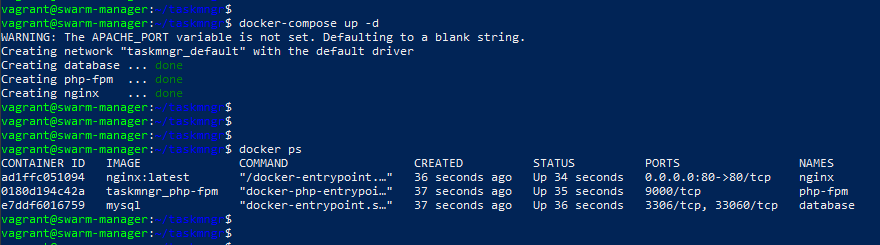
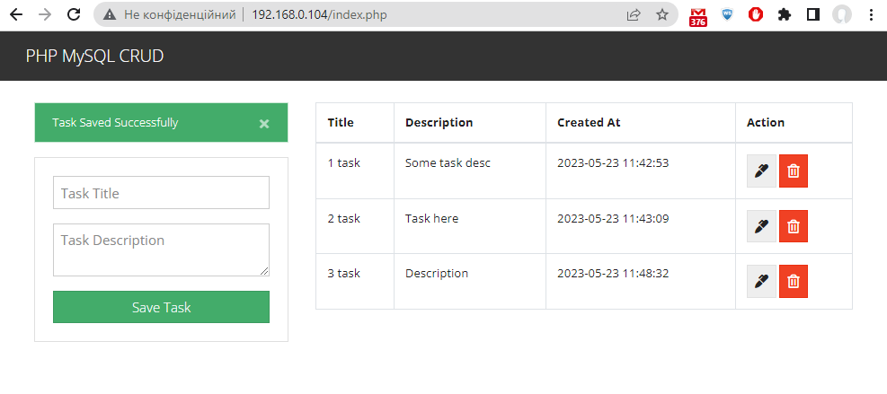
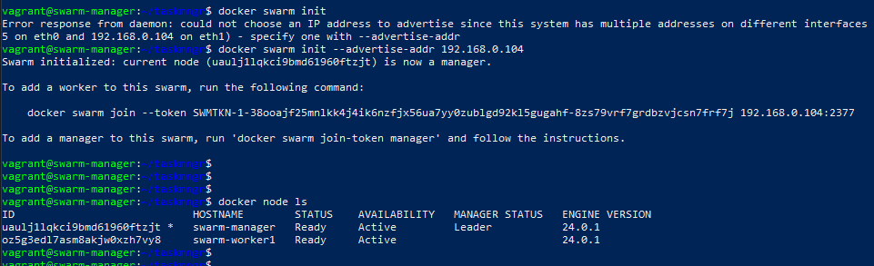
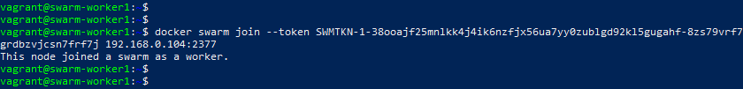
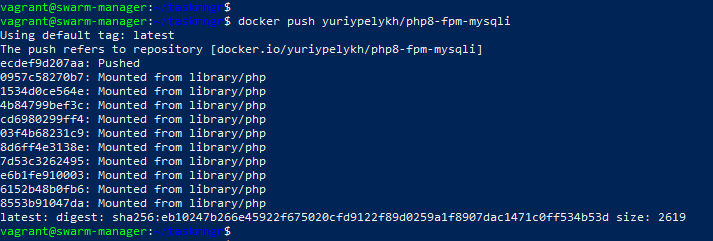
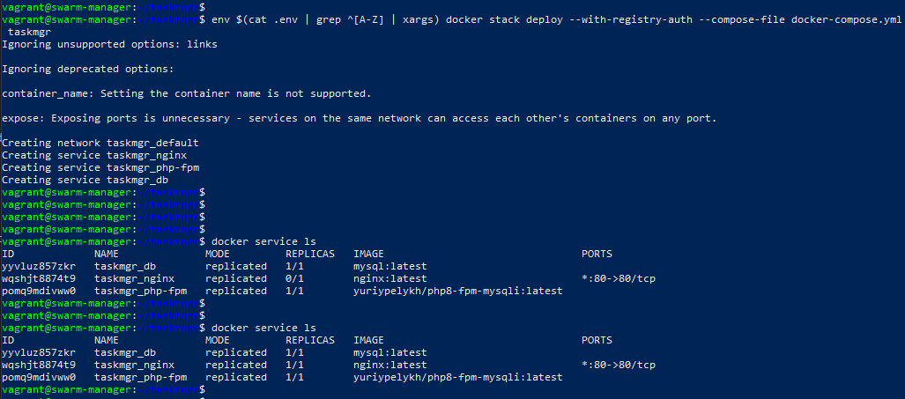
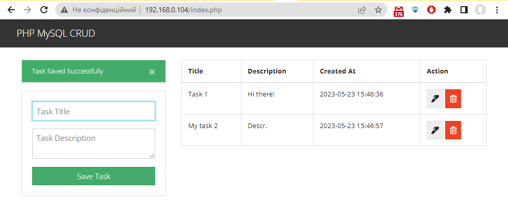
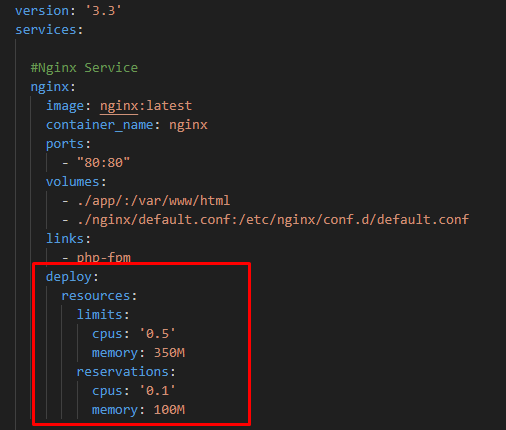
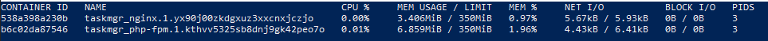

# Task 2 - Practice: Deploy PHP + NGINX application in Docker containers

## Task details:  
Prepare solutions for deploying a Docker application consisting of 2 components: NGINX + PHP. You can take any simple project as a basis.
Will be a plus:
- Use swarm mode.
- Configure limits for services based on RAM/CPU.
- Configure logging of project logs from containers' stdout.


# Task report:

## Files:
- [ ] Vagrant files for fast VMs creation: [vagrant/](./vagrant/)
- [ ] Docker-compose yaml file: [docker-compose.yml](./docker-compose.yml)
- [ ] PHP-application directory [app/](./app/)
- [ ] Nginx service configurations directory: [nginx/](./nginx/)
- [ ] Php-fpm service configurations directory: [php-fpm/](./php-fpm/)
- [ ] File with environmental variables for docker-compose: [.env](./.env)

## Part 1: Simple deploy on VM with docker-compose

1. A VM with Docker Engine installed was deployed via vagrant for a testing purposes to get working configuration for a stack: PHP-Nginx-MySQL.

2. Simple PHP application - Task manager - was taken from here for tests: [https://github.com/FaztWeb/php-mysql-crud](https://github.com/FaztWeb/php-mysql-crud).

3. docker-compose.yml contents:
```
version: '3.3'
services:
  
  #Nginx Service
  nginx:
    image: nginx:latest
    container_name: nginx
    ports:
      - "80:80"
    volumes:
      - ./app/:/var/www/html
      - ./nginx/default.conf:/etc/nginx/conf.d/default.conf
    links:
      - php-fpm
  
  #PHP Service
  php-fpm:
    build: ./php-fpm
    container_name: php-fpm
    env_file:
      - .env
    expose:
      - 9000
    volumes:
      - ./app/:/var/www/html
    depends_on:
      - db
    environment:
      - DB_SERVER=${DB_SERVER}
      - DB_USER=${DB_USER}
      - MYSQL_ROOT_PASSWORD=${MYSQL_ROOT_PASSWORD}
      - DB_NAME=${DB_NAME}

  ## Database service
  db:
    image: mysql
    container_name: database
    env_file:
      - .env
    environment:
      - MYSQL_ROOT_PASSWORD=${MYSQL_ROOT_PASSWORD}
    volumes:
      - db_data:/var/lib/mysql

#Volumes
volumes:
  db_data:
    driver: local
```

Nginx server configuration in `default.conf` file looks like:

```
server {
    index index.php index.html;
    server_name phpfpm.local;
    error_log  /var/log/nginx/error.log;
    access_log /var/log/nginx/access.log;
    root /var/www/html;
    location ~ \.php$ {
        try_files $uri =404;
        fastcgi_split_path_info ^(.+\.php)(/.+)$;
        fastcgi_pass php-fpm:9000;
        fastcgi_index index.php;
        include fastcgi_params;
        fastcgi_param SCRIPT_FILENAME $document_root$fastcgi_script_name;
        fastcgi_param PATH_INFO $fastcgi_path_info;
    }
}
```

And we should install `mysqli` in php-fpm service by building custom image with Dockerfile:

```
FROM php:8-fpm

RUN docker-php-ext-install mysqli && docker-php-ext-enable mysqli
```

4. As a result of `docker-compose up -d` command execution we got 3 running containers with Php-fpm, Nginx web-server an MySQL database:



5. And try to open Nginx server's address:



## Part 2: Docker swarm mode

1. Manager node initialization and adding worker node to the cluster:





2. Build docker image for php-fpm-mysqli and push it to registry:




3. Specify image for php-fpm with mysqli service:


4. And deploy a stack:

Note: `deploy` command doesn't support passing values for environment variables from `.var` file, so something like this was used to do it:

```
env $(cat .env | grep ^[A-Z] | xargs) docker stack deploy --with-registry-auth --compose-file docker-compose.yml
 taskmgr
```


5. Checkout working stack via browser:



## Part 3: CPU/RAM limits configuration

1. To limt CPU/RAM resources the following settings can be added to service's configuration in `docker-compose.yml`:

```
    deploy:
      resources:
        limits:
          cpus: '0.5'
          memory: 350M
        reservations:
          cpus: '0.1'
          memory: 100M
```

So file will look like:



2. Result of `docker stats` command:



## Part 4: Logging from container's stdout


