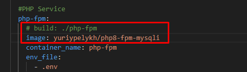

# Task 2 - Practice: Deploy PHP + NGINX application in Docker containers

## Task details:  
Prepare solutions for deploying a Docker application consisting of 2 components: NGINX + PHP. You can take any simple project as a basis.
Will be a plus:
- Use swarm mode.
- Configure limits for services based on RAM/CPU.
- Configure logging of project logs from containers' stdout.


# Task report:

## Files:
- [ ] Vagrant files for fast VMs creation: [vagrant/](./vagrant/)
- [ ] Docker-compose yaml file: [docker-compose.yml](./docker-compose.yml)
- [ ] PHP-application directory [app/](./app/)
- [ ] Nginx service configurations directory: [nginx/](./nginx/)
- [ ] Php-fpm service configurations directory: [php-fpm/](./php-fpm/)
- [ ] ELK Stack configurations directory: [elk/](./elk/)
- [ ] File with environmental variables for docker-compose: [.env](./.env)

## Part 1: Simple deploy on VM with docker-compose

1. A VM with Docker Engine installed was deployed via vagrant for a testing purposes to get working configuration for a stack: PHP-Nginx-MySQL.

2. Simple PHP application - Task manager - was [taken from here](https://github.com/FaztWeb/php-mysql-crud) for tests.

3. To deploy our stack consisting few containers a docker-compose can be used as most easy way to get up all stack at once. `docker-compose.yml` contents:
```
version: '3.3'
services:
  
  #Nginx Service
  nginx:
    image: nginx:latest
    container_name: nginx
    ports:
      - "80:80"
    volumes:
      - ./app/:/var/www/html
      - ./nginx/default.conf:/etc/nginx/conf.d/default.conf
    links:
      - php-fpm
  
  #PHP Service
  php-fpm:
    build: ./php-fpm
    container_name: php-fpm
    env_file:
      - .env
    expose:
      - 9000
    volumes:
      - ./app/:/var/www/html
    depends_on:
      - db
    environment:
      - DB_SERVER=${DB_SERVER}
      - DB_USER=${DB_USER}
      - MYSQL_ROOT_PASSWORD=${MYSQL_ROOT_PASSWORD}
      - DB_NAME=${DB_NAME}

  ## Database service
  db:
    image: mysql
    container_name: database
    env_file:
      - .env
    environment:
      - MYSQL_ROOT_PASSWORD=${MYSQL_ROOT_PASSWORD}
    volumes:
      - db_data:/var/lib/mysql

#Volumes
volumes:
  db_data:
    driver: local
```

Nginx server configuration in `default.conf` file looks like:

```
server {
    index index.php index.html;
    server_name phpfpm.local;
    error_log  /var/log/nginx/error.log;
    access_log /var/log/nginx/access.log;
    root /var/www/html;
    location ~ \.php$ {
        try_files $uri =404;
        fastcgi_split_path_info ^(.+\.php)(/.+)$;
        fastcgi_pass php-fpm:9000;
        fastcgi_index index.php;
        include fastcgi_params;
        fastcgi_param SCRIPT_FILENAME $document_root$fastcgi_script_name;
        fastcgi_param PATH_INFO $fastcgi_path_info;
    }
}
```

And we should install `mysqli` in php-fpm service by building custom image from Dockerfile:

```
FROM php:8-fpm

RUN docker-php-ext-install mysqli && docker-php-ext-enable mysqli
```

4. As a result of `docker-compose up -d` execution we got 3 running containers with Php-fpm, Nginx web-server an MySQL database:


5. And try to open Nginx server's address:


## Part 2: Docker swarm mode

1. Manager node initialization and adding worker node to the cluster:


2. Build docker image for php-fpm-mysqli and push it to registry:


3. Specify image for php-fpm with mysqli service:



4. And deploy a stack:

Note: `deploy` command doesn't support passing values for environment variables from `.var` file, so something like this was used to do it:

```
env $(cat .env | grep ^[A-Z] | xargs) docker stack deploy --with-registry-auth --compose-file docker-compose.yml taskmgr
```


5. Checkout if stack is working via browser:


## Part 3: CPU/RAM limits configuration

1. To limt CPU/RAM resources consumed by contasners the following settings can be added to service's configuration in `docker-compose.yml`:

```
    deploy:
      resources:
        limits:
          cpus: '0.5'
          memory: 350M
        reservations:
          cpus: '0.1'
          memory: 100M
```

In file it shuld be placed here:


2. Result of `docker stats` command:


## Part 4: Docker logging with ELK Stack

1. `docker-compose.yml` file was supplemented with the configuration of the `gelf` log driver, which will send containers' `sdtuot` to the Logstash service:

```
logging:
  driver: gelf
  options:
    gelf-address: "udp://192.168.0.102:12201"
    tag: "nginx"
```

3. Build of the docker image for ELK Stack and push it to registry:


2. ELK stack (Elasticsearch + Logstash + Kibana) will be deployed in the separate container with placement constraint on the swarm-manager server:

```
## ELK Stack service
  elk:
    image: yuriypelykh/elk_yp:v4
    container_name: elk
    ports:
      - "5601:5601"       #kibana
      - "9200:9200"       #elastic
      # - "5044:5044"       #logstash beats filebeat
      - "12201:12201/udp" #gelf
    deploy:
      resources:
        limits:
          cpus: '2'
          memory: 4096M
        reservations:
          cpus: '0.5'
          memory: 256M
      placement:
        constraints: [node.hostname == swarm-manager]
```

3. The final version of the `docker-compose.yml` will look like:

```
version: '3.3'
services:
  
  #Nginx Service
  nginx:
    image: nginx:latest
    container_name: nginx
    ports:
      - "80:80"
    volumes:
      - ./app/:/var/www/html
      - ./nginx/default.conf:/etc/nginx/conf.d/default.conf
    links:
      - php-fpm
    depends_on:
      - elk
    deploy:
      resources:
        limits:
          cpus: '1'
          memory: 512M
        reservations:
          cpus: '0.1'
          memory: 100M
    logging:
      driver: gelf
      options:
        gelf-address: "udp://192.168.0.105:12201"
        tag: "nginx"
  
  #PHP Service
  php-fpm:
    # build: ./php-fpm
    image: yuriypelykh/php8-fpm-mysqli
    container_name: php-fpm
    env_file:
      - .env
    expose:
      - 9000
    volumes:
      - ./app/:/var/www/html
    depends_on:
      - db
    environment:
      - DB_SERVER=${DB_SERVER}
      - DB_USER=${DB_USER}
      - MYSQL_ROOT_PASSWORD=${MYSQL_ROOT_PASSWORD}
      - DB_NAME=${DB_NAME}
    deploy:
      resources:
        limits:
          cpus: '1'
          memory: 512M
        reservations:
          cpus: '0.1'
          memory: 100M
    logging:
      driver: gelf
      options:
        gelf-address: "udp://192.168.0.105:12201"
        tag: "php-fpm"

  ## Database service
  db:
    image: mysql
    container_name: database
    env_file:
      - .env
    environment:
      - MYSQL_ROOT_PASSWORD=${MYSQL_ROOT_PASSWORD}
    volumes:
      - db_data:/var/lib/mysql
  
  ## ELK Stack service
  elk:
    image: yuriypelykh/elk_yp:v4
    container_name: elk
    ports:
      - "5601:5601"       #kibana
      - "9200:9200"       #elastic
      # - "5044:5044"       #logstash beats filebeat
      - "12201:12201/udp" #gelf
    deploy:
      resources:
        limits:
          cpus: '2'
          memory: 4096M
        reservations:
          cpus: '0.5'
          memory: 256M
      placement:
        constraints: [node.hostname == swarm-manager]

#Volumes
volumes:
  db_data:
    driver: local
```

4. Deploy the stack and check results:


PHP-service deployed successfully:


Kibana answers on the port 5601 and our logs from nginx and php-fpm services are available as expected:


# Sources

- [ ] [Dockerize your PHP application with Nginx and PHP8-FPM](https://marc.it/dockerize-application-with-nginx-and-php8/)
- [ ] [Docker swarm stacks/services resource limits and reservations](https://jmarcos-cano.medium.com/docker-swarm-stacks-resources-limit-f447ee74cb62)
- [ ] [Setting Memory and CPU Limits In Docker](https://www.baeldung.com/ops/docker-memory-limit)
- [ ] [Docker Swarm](https://habr.com/ru/articles/659813/)
- [ ] [Стек ELK (Elasticsearch, Logstash и Kibana) - что это такое? Применение, установка и настройка](https://gitinsky.com/elkstack)
- [ ] [Elasticsearch, Logstash, Kibana (ELK) Docker image documentation](https://elk-docker.readthedocs.io/)
- [ ] [3. Logstash - Пример централизованного сбора логов](https://www.youtube.com/watch?v=KYmhVrLkm9A&ab_channel=%D0%90%D0%BB%D0%B5%D0%BA%D1%81%D0%B5%D0%B9%D0%9C%D0%B5%D0%B4%D0%BE%D0%B2)
- [ ] [ELK-стек](https://habr.com/ru/articles/671344/)
- [ ] [Send docker logs to ELK through gelf log driver](https://gist.github.com/eunomie/e7a183602b8734c47058d277700fdc2d#file-docker-compose-yml-L16)
- [ ] [ELK на Docker](https://habr.com/ru/articles/282866/)