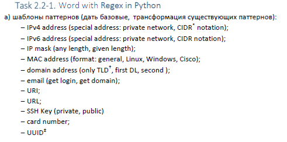
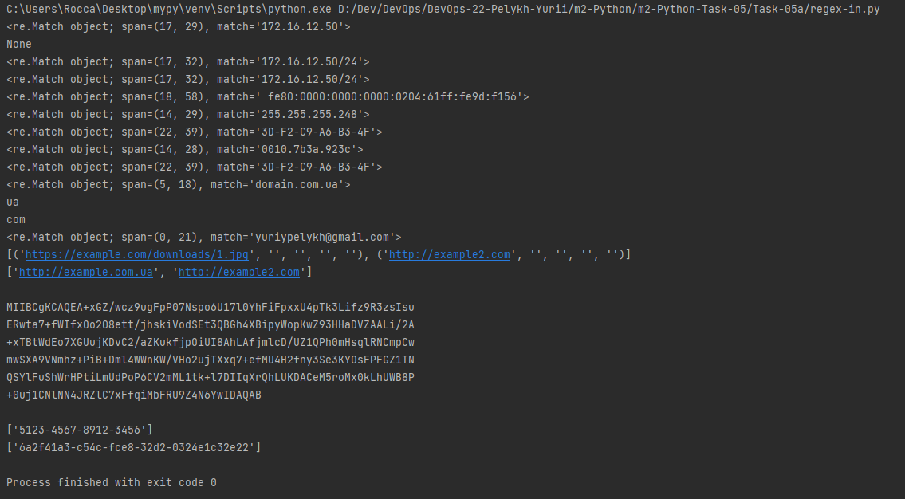

## Task 5a "Word with Regex in Python"

Task details:  
  

Script - [regex-in.py](./regex-in.py) 

Result of work:  

 

### IPv4 address  
* simple:  
> \d{1,3}\.\d{1,3}\.\d{1,3}\.\d{1,3}

* valid:  
> (([0-9]|[1-9][0-9]|1[0-9]{2}|2[0-4][0-9]|25[0-5])\.){3}([0-9]|[1-9][0-9]|1[0-9]{2}|2[0-4][0-9]|25[0-5])$

* with CIDR:
> ((25[0-5]|2[0-4][0-9]|[01]?[0-9][0-9]?)\.){3}(25[0-5]|2[0-4][0-9]|[01]?[0-9][0-9]?)([/][0-3][0-2]?|[/][1-2][0-9]|[/][0-9])?$

* CIDR separately:
> ([/][0-3][0-2]?|[/][1-2][0-9]|[/][0-9])?

* private networks:
> (10(\.(25[0-5]|2[0-4][0-9]|1[0-9]{1,2}|[0-9]{1,2})){3}|((172\.(1[6-9]|2[0-9]|3[01]))|192\.168)(\.(25[0-5]|2[0-4][0-9]|1[0-9]{1,2}|[0-9]{1,2})){2})([/][0-3][0-2]?|[/][1-2][0-9]|[/][0-9])?$

### IPv6 address
> \s*((([0-9A-Fa-f]{1,4}:){7}([0-9A-Fa-f]{1,4}|:))|(([0-9A-Fa-f]{1,4}:)
                          r"{6}(:[0-9A-Fa-f]{1,4}|((25[0-5]|2[0-4]\d|1\d\d|[1-9]?\d)(\.(25[0-5]|2[0-4]\d|1\d\d|[1-9]?"
                          r"\d)){3})|:))|(([0-9A-Fa-f]{1,4}:){5}(((:[0-9A-Fa-f]{1,4}){1,2})|:((25[0-5]|2[0-4]\d|1\d\d"
                          r"|[1-9]?\d)(\.(25[0-5]|2[0-4]\d|1\d\d|[1-9]?\d)){3})|:))|(([0-9A-Fa-f]{1,4}:){4}(((:"
                          r"[0-9A-Fa-f]{1,4}){1,3})|((:[0-9A-Fa-f]{1,4})?:((25[0-5]|2[0-4]\d|1\d\d|[1-9]?\d)(\.(25[0-5]"
                          r"|2[0-4]\d|1\d\d|[1-9]?\d)){3}))|:))|(([0-9A-Fa-f]{1,4}:){3}(((:[0-9A-Fa-f]{1,4}){1,4})|((:"
                          r"[0-9A-Fa-f]{1,4}){0,2}:((25[0-5]|2[0-4]\d|1\d\d|[1-9]?\d)(\.(25[0-5]|2[0-4]\d|1\d\d|[1-9]?"
                          r"\d)){3}))|:))|(([0-9A-Fa-f]{1,4}:){2}(((:[0-9A-Fa-f]{1,4}){1,5})|((:[0-9A-Fa-f]{1,4})"
                          r"{0,3}:((25[0-5]|2[0-4]\d|1\d\d|[1-9]?\d)(\.(25[0-5]|2[0-4]\d|1\d\d|[1-9]?\d))"
                          r"{3}))|:))|(([0-9A-Fa-f]{1,4}:){1}(((:[0-9A-Fa-f]{1,4}){1,6})|((:[0-9A-Fa-f]{1,4})"
                          r"{0,4}:((25[0-5]|2[0-4]\d|1\d\d|[1-9]?\d)(\.(25[0-5]|2[0-4]\d|1\d\d|[1-9]?\d))"
                          r"{3}))|:))|(:(((:[0-9A-Fa-f]{1,4}){1,7})|((:[0-9A-Fa-f]{1,4}){0,5}:((25[0-5]|2[0-4]"
                          r"\d|1\d\d|[1-9]?\d)(\.(25[0-5]|2[0-4]\d|1\d\d|[1-9]?\d)){3}))|:)))(%.+)?\s*$

### IP mask
> ((25[0-5]|2[0-4][0-9]|[01]?[0-9][0-9]?)\.){3}(25[0-5]|2[0-4][0-9]|[01]?[0-9][0-9]?)$

### MAC address
* Linux/Windows:
> ([0-9A-Fa-f]{2}[:-]){5}([0-9A-Fa-f]{2})$
* Cisco:
> ([0-9A-Fa-f]{4}\.){2}([0-9A-Fa-f]{4})$
* Any:
> \b(?:(?<![-:\.])(?:(?:[0-9A-Fa-f]{2}(?=([-:\.]))(?:\1[0-9A-Fa-f]{2}){5})|(?:[0-9A-Fa-f]{4}'
                        r'(?=([-:\.]))(?:\2[0-9A-Fa-f]{4}){2}))(?![-:\.])|(?:[0-9A-Fa-f]{12}))\b

### Domain address
* general:
>([A-Za-z0-9]\.|[A-Za-z0-9][A-Za-z0-9-]{0,61}[A-Za-z0-9]\.){1,3}[A-Za-z]{2,6}$

### E-mail
>[^@]+@[^@]+\.[^@]+

### URI
> (?i)\b((?:https?://|www\d{0,3}[.]|[a-z0-9.\-]+[.][a-z]{2,4}/)(?:[^\s()<>]+|\(([^\s()<>]+|(\([^'
                      r'\s()<>]+\)))*\))+(?:\(([^\s()<>]+|(\([^\s()<>]+\)))*\)|[^\s`!()\[\]{};:\'".,<>?«»“”‘’]))

### URL
> https?://(?:[-\w.]|(?:%[\da-fA-F]{2}))+
### SSH Key
> -{3}\n([\s\S]*?)\n-{3}

### Card number
> (?:[0-9]{4}-){3}[0-9]{4}|[0-9]{16}

### UUID
> [0-9a-fA-F]{8}\-[0-9a-fA-F]{4}\-[0-9a-fA-F]{4}\-[0-9a-fA-F]{4}\-[0-9a-fA-F]{12}
