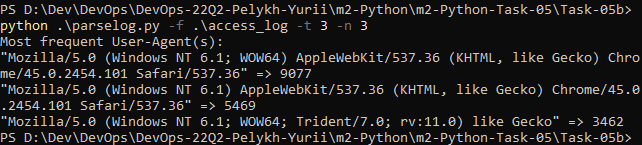
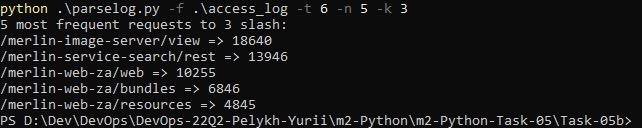

## Task 5b "Parsing access.log"

Task details:  
  

Scripts - [parselog.py](./parselog.py), [parseargs.py](./parseargs.py) 

### How it works:
Script's help-page:

 
####Task 1
Browser IP's statistics. Returning of N most frequent IPs:

####Task 2
Requests frequency in specified time interval dT:

####Task 3
N most frequent User-Agents:

####Task 4
Statistics of 50X-errors count per dT (seconds) intervals:

####Task 5
N of most long or short requests:
  

####Task 6
N most frequent requests till K-th slash:

####Task 7
Number of requests per Workers:

####Task 8
Statistics by Referers. Sorting by number of transfers (default) or by name:

####Task 9
Count of requests for Workers per dT time intervals:

####Task 10
Return N time intervals dT with a biggest number of requests:

