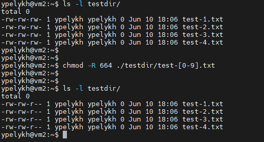

# m3-Linux-Task-01 Pipes  

#### 1. Найти все системные группы и получить только их уникальные имена и id. Сохранить в файл.
>grep -E -o '[a-z\-]+:.:[0-9]{1,3}:' /etc/group | cut -d ":" -f 1,3 --output-delimiter=' ' > ./system_groups

#### 2. Найти все файлы и директории, которые имеют права для доступа соответствующих user и group.
>find /home -perm /u=r -perm /g=r

#### 3. Найти все скрипты в указанной директории и ее поддиректориях.
>grep -rl /home -e "#!"

[Source 1](https://ru.stackoverflow.com/questions/639486/%D0%9A%D0%B0%D0%BA-%D0%BD%D0%B0%D0%B9%D1%82%D0%B8-%D0%B2%D1%81%D0%B5-%D1%84%D0%B0%D0%B9%D0%BB%D1%8B-%D1%81%D0%BE%D0%B4%D0%B5%D1%80%D0%B6%D0%B0%D1%89%D0%B8%D0%B5-%D0%B8%D1%81%D0%BA%D0%BE%D0%BC%D1%8B%D0%B9-%D1%82%D0%B5%D0%BA%D1%81%D1%82-%D0%BD%D0%B0-linux)

#### 4. Выполнить поиск файлов скриптов из-под определенного пользователя  
>su test-user -c 'grep -rls /home -e "#!"'

  

#### 5. Выполнить рекурсивный поиск слов или фразы для определенного типа файлов
>find . -type f -name ".sh" | grep -R '/bin/bash'

#### 6. Найти дубликаты файлов в заданных каталогах. Вначале сравнивать по размеру, затем по варианту (выбрать хешь функцию: CRC32, MD5, SHA-1, sha224sum). Результат должен быть отсортирован по имени файла.
>find . -type f | xargs stat -c%s | sort | uniq -d | xargs -I {} -n1 find ! -empty -type f -size {}c | xargs md5sum | sort | uniq -w32 -dD

#### 7. Найти по имени файла и его пути все символьные ссылки на него.
>sudo find /home/ -type l | xargs stat -c%N | grep /home/ypelykh/hello_world.sh

#### 8. Найти по имени файла и его пути все жесткие ссылки на него.
>ls -i ./hello_world.sh | cut -d' ' -f1 | xargs find /home/ypelykh/ -inum

#### 9. Имеется только inode файла найти все его имена.
> find /home/ypelykh/ -inum 5087

#### 10. Имеется только inode файла найти все его имена. Учтите, что может быть примонтированно несколько разделов
>find /home/ypelykh/ -inum 5087 -mount

#### 11. Корректно удалить файл с учетом возможности существования символьных или жестких ссылок
>find /home/ypelykh/ -type l | xargs stat -c%N | grep /home/ypelykh/hello_world2.sh | cut -d' ' -f1 | xargs rm -f ; ls -i /home/ypelykh/hello_world2.sh | cut -d' ' -f1 | xargs find /home/ypelykh/ -inum | xargs rm -f

#### 12. Рекурсивно изменить права доступа к файлам (задана маска файла) в заданной директории
>chmod -R 664 ./testdir/test-[0-9].txt

#### 13. * Сравнить рекурсивно две директории и отобразить только отличающиеся файлы. * (вывести до 2 строки и после 3 строки относительно строки в которой найдено отличие).
> diff -r -c2 dir1/ dir2/

#### 14. Получить MAC-адреса сетевых интерфейсов
>ip a | grep -i '\([0-9a-fA-F]\{2\}:\)\{5\}[0-9a-fA-F]\{2\}' | cut -d' ' -f6

#### 15. Вывести список пользователей, авторизованных в системе на текущий момент
> who
> w

#### 16. Вывести список активных сетевых соединений в виде таблицы: тип состояния соединения и их количество
>ss -atH | cut -d " " -f1 | sort | uniq -ci

#### 17. Переназначить существующую символьную ссылку.
>ln -sf $PWD/tstfile test_slink

#### 18. Имеется список файлов с относительным путем и путем к каталогу, в котором должна храниться символьная ссылка на файл. Создать символьные ссылки на эти файлы
>realpath ./dir1/* | xargs -I {} ln -sf {} /home/ypelykh/s_links/

#### 19-20. Скопировать директорию с учетом, что в ней существуют как прямые так относительные символьные ссылки на файлы и директории. Предполагается, что копирование выполняется for backup on a removable storage. (сделать в двух вариантах, без rsync и с rsync)
>rsync -rb --copy-links ./s_links/ ./dir1_backup/

>cp -br s_links/* dir1_cp_backup/

#### 21. Скопировать все файлы и директории из указанной директории в новое расположение с сохранением атрибутов и прав
>rsync -rpgt ./dir1/* ./dir1_backup/
>>-p, --perms - сохранять разрешения  
>>-o, --owner - сохранять владельца (только root)  
>>-g, --group - сохранять группу  
>>-t, --times - сохранять время  

#### 22. В директории проекта преобразовать все относительные ссылки в прямые.
>find s_links/ -type l -exec bash -c 'realpath "{}" &> /dev/null && ln -sf "$(realpath "{}")" "{}"' \;

#### 23. В директории проекта преобразовать все прямые ссылки в относительные для директории проекта.
> find s_links/ -type l -exec bash -c 'realpath "{}" --relative-to=s_links/ &> /dev/null && ln -sf "$(realpath "{}" --relative-to=s_links/)" "{}"' \;

#### 24. В указанной директории найти все сломанные ссылки и удалить их
>find dir1_cp_backup/anotherdir/ -xtype l -exec rm -f {} \;

#### 25. Распаковать из архива tar, gz, bz2, lz, lzma, xz, Z определенный каталог/файл в указанное место.
>tar -C testdir/ -xf dir1_bak.tar dir1_cp_backup/anotherdir/file3 --strip-components 2

#### 26. Упаковать структуру директорию с файлами с сохранением всех прав и атрибутов
>tar -czpf dir1_bak.tar dir1_cp_backup/

#### 27. Рекурсивно скопировать структуру каталогов из указанной директории. (без файлов)
>rsync -av -f"+ */" -f"- *" testdir/ dest/

#### 28. Вывести список всех пользователей системы (только имена) по алфавиту
>getent passwd {1000..60000} | cut -d: -f1 | sort

#### 29. Вывести список всех системных пользователей системы отсортированных по id, в формате: login id
>getent passwd {1000..60000} | cut -d: -f'1 3' --output-delimiter=' ' | sort -k2

#### 30. Вывести список всех пользователей системы (только имена) отсортированные по id в обратном порядке
>getent passwd {1000..60000} | cut -d: -f'1 3' --output-delimiter=' ' | sort -k2 -r | cut -d' ' -f1

#### 31. Вывести всех пользователей, которые не имеют право авторизовываться или не имеют право авторизовываться в системе. (две команды)
>getent passwd | grep -E 'sbin/nologin|bin/false' | cut -d: -f 1

#### 32. Вывести всех пользователей, которые (имеют/не имеют) терминала (bash, sh, zsh and etc.) (две команды)
>getent passwd | grep -E '/bash|/sh|/zsh' | cut -d: -f 1
> 
>getent passwd | grep -v -E '/bash|/sh|/zsh' | cut -d: -f 1

#### 33. Со страницы из интернета закачать все ссылки на ресурсы href, которые на странице. a) Использовать curl и wget. Закачивать параллельно. b) Дать рекомендации по использованию.  
Wget only:  
> wget -r -k -l 2 -p -E -nc google.com.ua

> Wget params:  
>-r	—	указывает на то, что нужно рекурсивно переходить по ссылкам на сайте, чтобы скачивать страницы.  
>-k	—	используется для того, чтобы wget преобразовал все ссылки в скаченных файлах таким образом, чтобы по ним можно было переходить на локальном компьютере (в автономном режиме).  
>-p	—	указывает на то, что нужно загрузить все файлы, которые требуются для отображения страниц (изображения, css и т.д.).  
>-l	—	определяет максимальную глубину вложенности страниц, которые wget должен скачать (по умолчанию значение равно 5, в примере мы установили 7). В большинстве случаев сайты имеют страницы с большой степенью вложенности и wget может просто «закопаться», скачивая новые страницы. Чтобы этого не произошло можно использовать параметр -l.  
>-E	—	добавлять к загруженным файлам расширение .html.  
>-nc —	при использовании данного параметра существующие файлы не будут перезаписаны. Это удобно, когда нужно продолжить загрузку сайта, прерванную в предыдущий раз.

Curl + wget (as required):  
>curl --no-progress-meter google.com.ua | grep -P '[HREFhref]{4}=".+?"' | grep -oP 'https*:.+?"' | rev | cut -c 2- | rev | xargs wget -r -k -l 1 -p -E -nc

#### 34. Остановить процессы, которые работают больше 5 дней. a) использовать killall; b) команду ps / killall не использовать.
> killall --older-than 5d [process_name]

#### 35. Имеется директория, в которой, существуют папки и файлы (*.txt & *.jpeg). Файлы *.txt и *.jpeg однозначно связаны между собой по префиксу имени. Файлы могут находиться в различном месте данной директории. Нужно удалить все *.jpeg для которых не существует файла *.txt.
>find ./pages/**/*.jpeg -printf '%f\n' | rev | cut -c 6- | rev | xargs -I {} sh -c 'if [ ! -e ./pages/**/{}.txt ]; then find ./pages/ -type f -name '{}.jpeg' -exec rm -rf ./pages/**/{}.jpeg \; ; fi'

#### 36. Find your IP address using the command line
> ip a | grep -oP '((25[0-5]|2[0-4][0-9]|[01]?[0-9][0-9]?)\.){3}(25[0-5]|2[0-4][0-9]|[01]?[0-9][0-9]?)([/][0-3][0-2]|[/][1-2][0-9]|[/][0-9])'

#### 37. Получить все ip-адресса из текстового файла
> cat ips.list | grep -oP '((25[0-5]|2[0-4][0-9]|[01]?[0-9][0-9]?)\.){3}(25[0-5]|2[0-4][0-9]|[01]?[0-9][0-9]?)'

#### 38. Найти все активные хосты в: - заданной сети, - списке IP (hosts-server.txt) используя/не используя nMAP;
Nmap:  
>nmap -sL 10.0.2.0/24 | grep -oP '\(((25[0-5]|2[0-4][0-9]|[01]?[0-9][0-9]?)\.){3}(25[0-5]|2[0-4][0-9]|[01]?[0-9][0-9]?)\)'

  

No nmap:  
>ping -w 3 -b 10.0.2.255 &>/dev/null; arp -a | grep -oP '((25[0-5]|2[0-4][0-9]|[01]?[0-9][0-9]?)\.){3}(25[0-5]|2[0-4][0-9]|[01]?[0-9][0-9]?)'

#### 39. Используя результат таска 36. Получить ip поднятых хостов
>ip a | grep -oP '((25[0-5]|2[0-4][0-9]|[01]?[0-9][0-9]?)\.){3}(25[0-5]|2[0-4][0-9]|[01]?[0-9][0-9]?)([/][0-3][0-2]|[/][1-2][0-9]|[/][0-9])' | grep -vP '127\.' | xargs nmap -sL | grep -P '\(.+\)'

#### 40. Получить все поддомены из SSL сертификата.
>openssl x509 -in /home/ypelykh/cert/cert.cer -text -noout | grep -oP 'CN = ([A-Za-z0-9]\.|[A-Za-z0-9][A-Za-z0-9-]{0,61}[A-Za-z0-9]\.){1,3}[A-Za-z]{2,6}' | cut -c 6-

