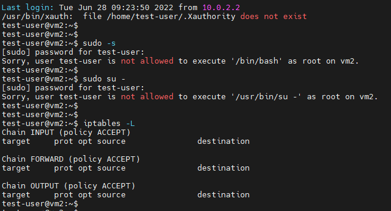

# Task-02 Password quality, user config automation  

### Task details:  
    

Script - [pwpolicy.sh](./pwpolicy.sh)    
Script, generating random passwords - [pswd-gen.py](./pswd-gen.py)  

### Samples of work:    
Script's help:  
  

Password quality provision:  
  

User creation and configuration:    
  

Ask to change password when first log-in:   
  

Blocked rising up to 'root' and allowed 'iptables' without 'sudo':        
  

Granted access to read /var/log/syslog:     

Disabling user and blocking IP on firewall:  
  
  
    

User removing:  
  

Used sources:    
 - [ ] [Bash args parser](https://stackoverflow.com/questions/192249/how-do-i-parse-command-line-arguments-in-bash)  
 - [ ] [Find and Replace Inside a Text File from a Bash Command](https://stackoverflow.com/questions/525592/find-and-replace-inside-a-text-file-from-a-bash-command)  
 - [ ] [Installing mailutils using apt-get without user intervention](https://stackoverflow.com/questions/15469343/installing-mailutils-using-apt-get-without-user-intervention)  
 - [ ] [How do I edit /etc/sudoers from a script?](https://stackoverflow.com/questions/323957/how-do-i-edit-etc-sudoers-from-a-script)  
 - [ ] [Prevent Files And Folders From Accidental Deletion](https://ostechnix.com/prevent-files-folders-accidental-deletion-modification-linux/)  
 - [ ] [Setfacl](https://www.kryukov.biz/soderzhanie/sistema-bezopasnosti/posix-acl/setfacl/)  
 - [ ] [How to define 'tab' delimiter with 'cut' in Bash?](https://unix.stackexchange.com/questions/35369/how-to-define-tab-delimiter-with-cut-in-bash)  
 - [ ] [How to set password policies in Linux](https://sysadmin78.ru/doku.php/how_to:how_to_set_password_policies_in_linux)  
 