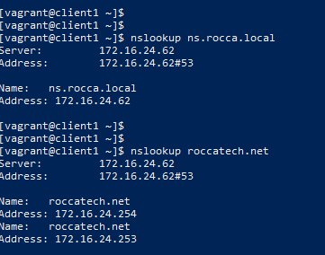

## Module Networks. Task 2: DHCP, DNS, Routing in LAN, Iptables  

Task details:  
  

#### Network topology according to task:
  
#### Due to lack of computing resources on host PC, network topology was simplified to:
  

### Files:
Vagrant file: [Vagrantfile](./Vagrantfile)  
VMs provision scripts:  
[dhcp-dns.sh](./dhcp-dns.sh)  
[rgw.sh](./rgw.sh)  
[r13.sh](./r13.sh)  
[rdmz3.sh](./rdmz3.sh)  
[client1.sh](./client1.sh)  
[nginx1.sh](./nginx1.sh)  

### Examples of work:  

Access to **Internet** from local network:  
  

Routing between **net1**, **net3**, **netdmz**:  
  

Hosts get IP parameters via **DHCP**:  
  

**DHCP-relay** configured on routers **R13** and **Rdmz3**:  
  

Two zones configured on **DNS-Server**: rocca.local and roccatech.net:  
  

Dynamic DNS was configured for rocca.local zone. DHCP-clients register in DNS automatically:       
  

**Nginx** Web-server returns a page, accessible from local network directly:        
  

...and from **Internet**:  
  

Users from Internet are forwarded to **Nginx-balancer** on **Rdmz3**, which returns a page based on randomly (Round-robin) return of IP for domain roccatech.net by **DNS-Server**.  

#### Used sources:  
- [ ] [VBoxManage modifyvm](https://docs.oracle.com/en/virtualization/virtualbox/6.0/user/vboxmanage-modifyvm.html)
- [ ] [IPTables Rule Generator](https://iptablesgenerator.totalbits.com/)
- [ ] [ISC DHCPD - разделяем клиентов на классы](https://unixforum.org/viewtopic.php?t=150654)
- [ ] [dhcrelay(8) - Linux man page](https://linux.die.net/man/8/dhcrelay)
- [ ] [dhcpd isn't matching this mac address](https://unix.stackexchange.com/questions/417814/dhcpd-isnt-matching-this-mac-address)
- [ ] [ISC DHCP - class matching based on mac address](https://www.linuxquestions.org/questions/linux-networking-3/isc-dhcp-class-matching-based-on-mac-address-825866/)
- [ ] [Replies to request coming over a relay goes to relay's internal IP](https://serverfault.com/questions/435453/replies-to-request-coming-over-a-relay-goes-to-relays-internal-ip-not-to-origi)
- [ ] [Replies to request coming over a relay goes to relay's internal IP](https://serverfault.com/questions/435453/replies-to-request-coming-over-a-relay-goes-to-relays-internal-ip-not-to-origi)
- [ ] [DHCP-RELAY В UBUNTU](https://poligon218.ru/2020/01/12/dhcp-relay-%D0%B2-linux/)
- [ ] [Установка Nginx в Ubuntu 20.04](https://www.digitalocean.com/community/tutorials/how-to-install-nginx-on-ubuntu-20-04-ru)
- [ ] [Установка Nginx в Ubuntu 20.04](https://www.digitalocean.com/community/tutorials/how-to-install-nginx-on-ubuntu-20-04-ru)
- [ ] [Why does /etc/resolv.conf point at 127.0.0.53?](https://unix.stackexchange.com/questions/612416/why-does-etc-resolv-conf-point-at-127-0-0-53)
- [ ] [Настройка BIND в качестве DNS-сервера частной сети на базе Ubuntu 18.04](https://www.digitalocean.com/community/tutorials/how-to-configure-bind-as-a-private-network-dns-server-on-ubuntu-18-04-ru)
- [ ] [Создание и настройка первичной зоны в BIND](https://www.dmosk.ru/miniinstruktions.php?mini=bind-primary)
- [ ] [Настройка DNS сервера bind](https://redos.red-soft.ru/base/server-configuring/customize-dns/customize-dns-bind/)
- [ ] [Can netplan configured nameservers supersede (not merge with) the DHCP nameservers?](https://askubuntu.com/questions/1001241/can-netplan-configured-nameservers-supersede-not-merge-with-the-dhcp-nameserve)
- [ ] [LXD: how to avoid double default gateway in ubuntu 18.04?](https://askubuntu.com/questions/1115213/lxd-how-to-avoid-double-default-gateway-in-ubuntu-18-04)
- [ ] [Балансировка сетевой нагрузки с помощью DNS сервера Bind в Ubuntu - DNS Round-Robin](https://howitmake.ru/blog/ubuntu/107.html)
- [ ] [DHCP + BIND9 автоматическое обновление DNS зоны при получении IP](http://helpers.com.ua/linux/bind/dhcp-bind9-avtomaticheskoe-obnovlenie-dns-zony-pri-poluchenii-ip/)
- [ ] [Настройка динамичекого обновления DNS](https://www.opennet.ru/base/net/auto_dns_dhcp.txt.html)
- [ ] [Настройка динамического обновления зоны на DNS-сервере Bind](https://linux-admins.ru/article.php?id_article=77&article_title=%D0%9D%D0%B0%D1%81%D1%82%D1%80%D0%BE%D0%B9%D0%BA%D0%B0%20%D0%B4%D0%B8%D0%BD%D0%B0%D0%BC%D0%B8%D1%87%D0%B5%D1%81%D0%BA%D0%BE%D0%B3%D0%BE%20%D0%BE%D0%B1%D0%BD%D0%BE%D0%B2%D0%BB%D0%B5%D0%BD%D0%B8%D1%8F%20%D0%B7%D0%BE%D0%BD%D1%8B%20%D0%BD%D0%B0%20DNS-%D1%81%D0%B5%D1%80%D0%B2%D0%B5%D1%80%D0%B5%20Bind)  

