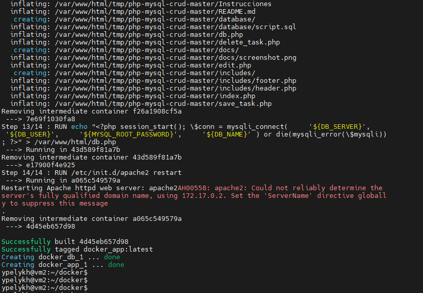
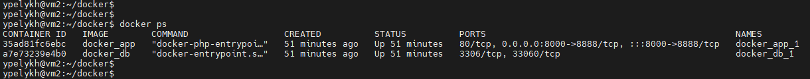
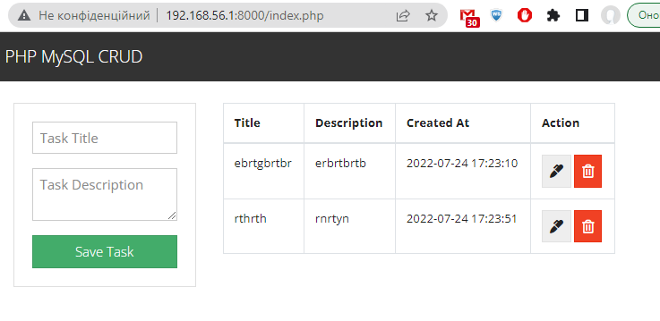

## Task 1: Containers - Docker and docker-compose

#### Task details:

>Написать docker-compose для https://github.com/FaztWeb/php-mysql-crud, который:  
>- поднимает веб-сервер в одном контейнере  
>- поднимает базу в другом контейнере  
>- использует сеть типа bridge  
>- порт апача должен быть не 80  
> 
>Будет плюсом:  
>+ порты в compose файле параметризированы  
>+ содержание базы данных должно быть сохранено при удалении docker-compose стека  
>+ использовать .ENV файл для локальных или конфиденциальных переменных (имя пользователя, пароль базы, и т.д.)  

#### Scripts:  
Docker Compose file: [docker-compose.yml](./docker-compose.yml)  
Application image build-file: [Dockerfile](./app/Dockerfile)  
Database image build-file: [Dockerfile](./db/Dockerfile)  
Environment variables file: [.env](./.env)  

#### Examples of work:  

Result of **docker-compose up -d**:  

Upped containers:  
  

Working web-application:  

#### Used sources:

- [ ] [Docker for absolute beginners with practice tests](https://www.youtube.com/watch?v=TI2eG_sjllg&list=PLxeQ-jZjcEf2HI9B0l1YuUy_-iAjlydwR&index=1)  
- [ ] [https://habr.com/ru/post/353238/](https://habr.com/ru/post/353238/)
- [ ] [PHP Websites using Docker Containers with PHP Apache and MySQL](https://www.section.io/engineering-education/dockerized-php-apache-and-mysql-container-development-environment/)  
- [ ] [Справочник по Dockerfile](https://dker.ru/docs/docker-engine/engine-reference/dockerfile-reference/)  
- [ ] [Pass argument to docker compose](https://stackoverflow.com/questions/43544328/pass-argument-to-docker-compose)

