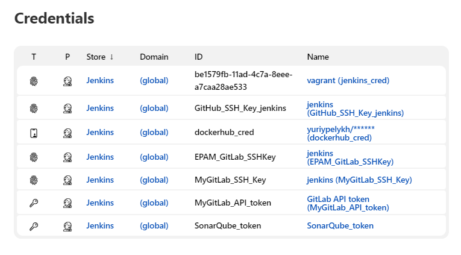
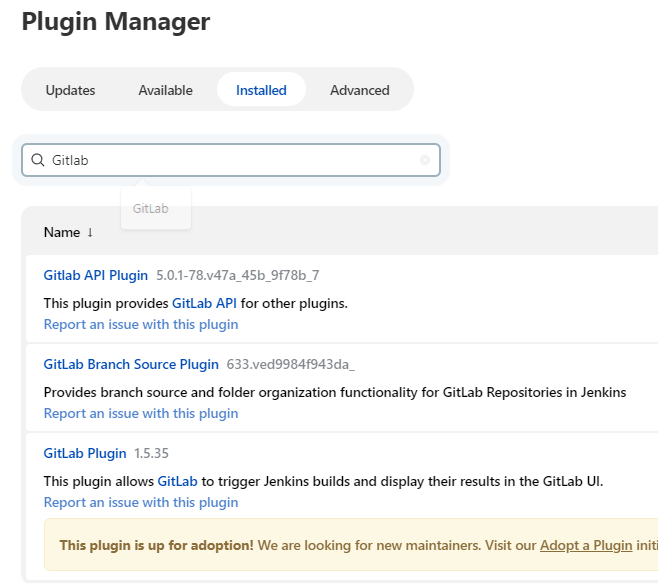

## Task 1: CI/CD

### Task details:  

Поднять и настроить Jenkins сервер.    
1. Настройка агентов  
1.1 статический (windows vs linux)  
1.2 динамический (например, https://www.jenkins.io/doc/book/pipeline/docker/)      
2. Поместить sensitive данные в credentials (github/gitlab connection details, etc)  
3. Настройка прав доступа. Создать три группы (dev, qa, devops и предоставить различные права доступа)    
 
Создать мультибранч пайплайн, который бы:  
1. Тригерился на изменение в любой ветке гит репозитория, для ветки создается отдельный пайплайн  
2. Пайплайн состоит из шагов  
  a. Клонировать репозиторий с feature ветки  
  b. Опционально: проверить коммит сообщение на соответствие best practice (длина сообщения, вначале код джира тикета)    
c. Линтинг Dockerfileов  
3. В случае фейла пайплайна - заблокировать возможность мержа feature ветки в основную ветку.  

Создать CI пайплайн:    
1. Смотрит на основную ветку репозитория (main/master/whatever)    
2. Тригерится на мерж в основную ветку  
3. Клонирует репозиторий  
4. Запускает статический анализ кода, Bugs, Vulnerabilities, Security Hotspots, Code Smells доступны на SonarQube сервере    
5. Билдит Docker образ  
6. Тегируем 2 раза образ (latest и версия билда)  
7. Пушим образ в Docker Hub  

Создать CD пайплайн:  
1. Параметры при запуске:    
a. Имя энва (dev/qa)  
b. Номер версии (т.е. тег образа, версия или latest). Будет плюсом, если этот список будет динамически подтягиваться из Dockerhub    
2. Деплой образа на выбранный энвайронмент  
3. Стейдж с healthcheck задеплоенногоо энва (curl endpoint or smth else)  

Будет плюсом:  
+ нотификации на почту или в тимз  
 
# Results:  
#### Static and dynamic agents:
Separate VM was upped (**node1**), SSH-keys on Jenkins were configured for ability to access node1:  
  
Node1 added via Jenkins Management panel:    
  

Dynamic agent may be launched in Docker-container from Pipeline script:  
  
```commandline
pipeline {
    agent {
        node {
            label 'Node1'
        }
    }
    stages {
        stage('Example Build') {
            agent { docker 'maven:3.8.1-adoptopenjdk-11' } 
            steps {
                echo 'Hello, Maven'
                sh 'mvn --version'
            }
        }
        stage('Example Test') {
            agent { docker 'openjdk:8-jre' } 
            steps {
                echo 'Hello, JDK'
                sh 'java -version'
            }
        }
    }
}
```
>In a case of error: **Got permission denied while trying to connect to the Docker daemon socket at unix:///var/run/docker.sock**:
>  
> Solution:  
> ```sudo chmod 666 /var/run/docker.sock```   
> Should be executed on node machine:  
>   

Pipeline in progress:  
  
"Example build" and "Example test" done:  
  
  

#### Example of sensitive data in Jenkins Credentials storage:  
  


## I. Multibranch Pipeline Demo:

Settings of multibranch pipeline in Jenkins:  

  


**Jenkinsfile** script: [Jenkinsfile](./Jenkinsfile)  
```commandline

```

### 1. Pipeline is triggered on changes in any branch of git repository, separate pipeline creates for each branch:


#### Sources:  
- [ ] [Jenkins Pipeline Syntax](https://www.jenkins.io/doc/book/pipeline/syntax/)  
- 
  
