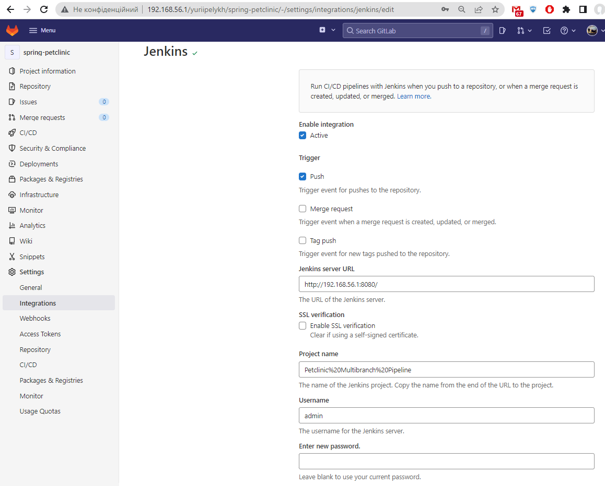
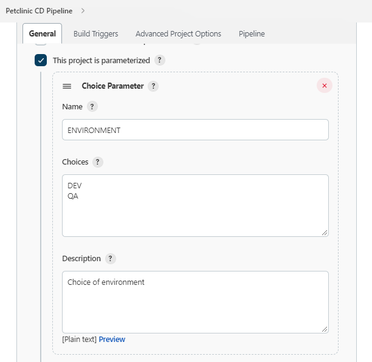
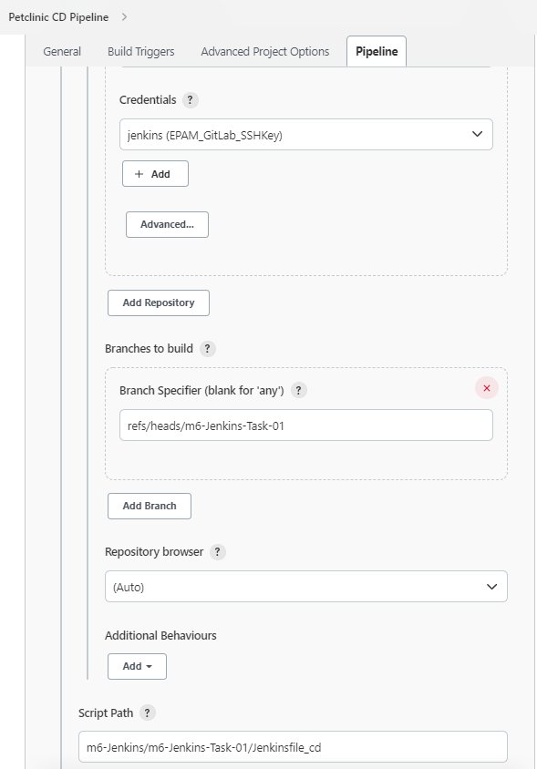
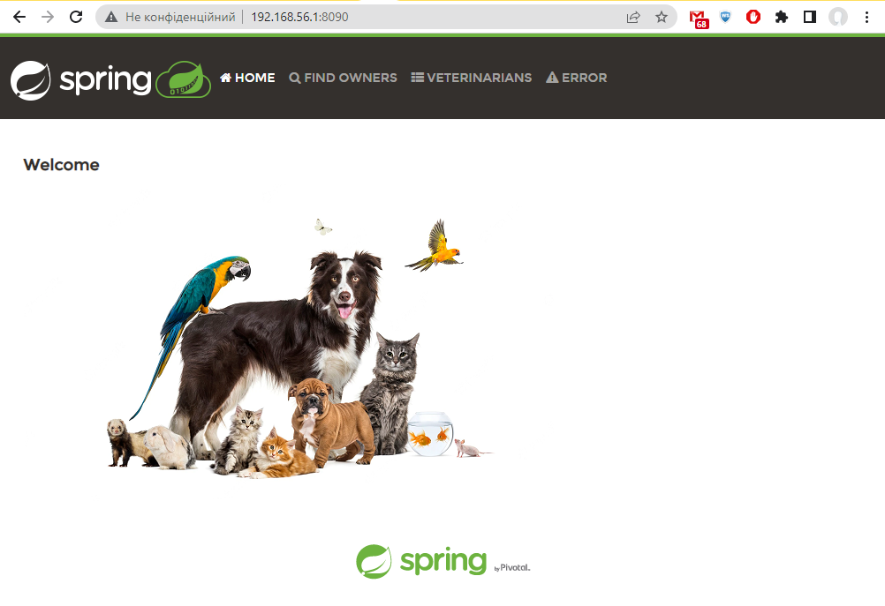

# Task 1: CI/CD

## Task details:  

Поднять и настроить Jenkins сервер.    
1. Настройка агентов  
1.1 статический (windows vs linux)  
1.2 динамический (например, https://www.jenkins.io/doc/book/pipeline/docker/)      
2. Поместить sensitive данные в credentials (github/gitlab connection details, etc)  
3. Настройка прав доступа. Создать три группы (dev, qa, devops и предоставить различные права доступа)    
 
Создать мультибранч пайплайн, который бы:  
1. Тригерился на изменение в любой ветке гит репозитория, для ветки создается отдельный пайплайн  
2. Пайплайн состоит из шагов  
  a. Клонировать репозиторий с feature ветки  
  b. Опционально: проверить коммит сообщение на соответствие best practice (длина сообщения, вначале код джира тикета)    
c. Линтинг Dockerfileов  
3. В случае фейла пайплайна - заблокировать возможность мержа feature ветки в основную ветку.  

Создать CI пайплайн:    
1. Смотрит на основную ветку репозитория (main/master/whatever)    
2. Тригерится на мерж в основную ветку  
3. Клонирует репозиторий  
4. Запускает статический анализ кода, Bugs, Vulnerabilities, Security Hotspots, Code Smells доступны на SonarQube сервере    
5. Билдит Docker образ  
6. Тегируем 2 раза образ (latest и версия билда)  
7. Пушим образ в Docker Hub  

Создать CD пайплайн:  
1. Параметры при запуске:    
a. Имя энва (dev/qa)  
b. Номер версии (т.е. тег образа, версия или latest). Будет плюсом, если этот список будет динамически подтягиваться из Dockerhub    
2. Деплой образа на выбранный энвайронмент  
3. Стейдж с healthcheck задеплоенногоо энва (curl endpoint or smth else)  

Будет плюсом:  
+ нотификации на почту или в тимз  
 
# Task report:  

>Due to impossibility of testing webhooks via mobile phone used as a home router (complicity of port forwarding configuration), such services as GitLab and SonarQube were deployed locally in Docker-containers.

Vagrant config files: [vagrant](./vagrant)   

### Static and dynamic agents:
Separate VM was upped (**node1**), SSH-keys on Jenkins were configured for ability to access node1:  
  
Node1 added via Jenkins Management panel:    
  

Dynamic agent may be launched in Docker-container from Pipeline script:  
  
```commandline
pipeline {
    agent {
        node {
            label 'Node1'
        }
    }
    stages {
        stage('Example Build') {
            agent { docker 'maven:3.8.1-adoptopenjdk-11' } 
            steps {
                echo 'Hello, Maven'
                sh 'mvn --version'
            }
        }
        stage('Example Test') {
            agent { docker 'openjdk:8-jre' } 
            steps {
                echo 'Hello, JDK'
                sh 'java -version'
            }
        }
    }
}
```
>In a case of error: **Got permission denied while trying to connect to the Docker daemon socket at unix:///var/run/docker.sock**:
>  
> Solution:  
> ```sudo chmod 666 /var/run/docker.sock```   
> Should be executed on node machine:  
>   

Pipeline's work:  
  
"Example build" and "Example test" done:  
  
  

### Example of sensitive data in Jenkins Credentials storage:  
  


# I. Multibranch Pipeline:

## Settings

#### General config in Jenkins:  

GitLab plugins needed be installed:  
  

Jenkins --> Configure System GitLab settings:  
  

Jenkins --> Configure System GitLab Server settings:  
  

#### Multibranch Pipeline configuration:  


#### GitLab configuration:

Jenkins was configured as an integrated external CI/CD processor for Gitlab, so settings on GitLab's side also need be made as described in [Jenkins integration](https://docs.gitlab.com/ee/integration/jenkins.html#configure-the-jenkins-server) and in [Merge when pipeline succeeds](https://docs.gitlab.com/ee/user/project/merge_requests/merge_when_pipeline_succeeds.html):    


>Note: if config was made correctly, GitLab icon appears in multibranch project:  
> 
> 


#### [Jenkinsfile](./Jenkinsfile) (placed in the app repo):  
```commandline
pipeline {
    agent any
    stages {
        stage('Clone repo from feature branch') {
            steps {
                git branch: "${BRANCH_NAME}",
                    credentialsId: 'MyGitLab_SSH_Key',
                    url: 'git@git.my.net:yuriipelykh/spring-petclinic.git'
                sh "ls -lat"
            }
        }

        stage('Commit message checkuot') {
            steps {
                script {
                    env.GIT_COMMIT_MSG = sh (script: 'git log -1 --pretty=%B ${GIT_COMMIT}', returnStdout: true).trim()
                }
                echo "Checking commit message format:\n${GIT_COMMIT_MSG}"
                sh '''#!/bin/bash
                    if [[ $(echo ${GIT_COMMIT_MSG} | grep -qP "^[A-Z]+-[0-9]+[0-9a-zA-z ,.:]{1,72}\\n*([0-9a-zA-Z ,.:]{1,80}\\n)*"; echo $?) == 0 ]]; then
                        echo 'Message checkout passed.'
                    else
                        echo 'Message does not complies with best practices. See: https://robertcooper.me/post/git-commit-messages'
                        exit 1
                    fi
                '''
            }
        }

        stage('Dockerfiles lint') {
            agent {
                docker {
                    image 'hadolint/hadolint:latest-debian'
                    args '-v ${WORKSPACE}/:/mnt/'
                }
            }
            steps {
                sh 'hadolint /mnt/Dockerfile'
            }
        }

        stage('GitLab Acknowledgement') {
          steps {
             echo 'Notify GitLab'
//             updateGitlabCommitStatus name: 'build', state: 'pending'
             updateGitlabCommitStatus name: 'build', state: 'success'
          }
       }
    }

    post {
        always{
            mail to: "yuriypelykh@gmail.com",
            subject: "jenkins build:${currentBuild.currentResult}: ${env.JOB_NAME}",
            body: "${currentBuild.currentResult}: Job ${env.JOB_NAME}\nMore Info can be found here: ${env.BUILD_URL}"
        }
    }
}


```

## Work demo:

#### Pipeline is triggered on changes in any branch of git repository, separate pipeline is created for each branch was renewed:


#### Push triggers a Petclinic Multibranch Pipeline in Jenkins. Jenkins creates separate pipeline for branch **change-image6**:  


#### Jenkins performs all stages, described in Jenkinsfile:  
- Clone repo from feature branch (change-image6);
- Commit message format checkout;
- Dockerfiles linting with Hadolint linter;
- Sends Acknowledgement to GitLab about status of pipeline. If it finishes successfully GitLab permits merge to 'main' branch:  

- Sends E-mail with pipeline status:


# II. CI Pipeline:

## Settings

#### General config in Jenkins needed:

SonarQube plugin ang it's config:


#### CI Pipeline config in Jenkins:


#### SonarQube configured according to [SonarScanner for Jenkins](https://docs.sonarqube.org/latest/analysis/scan/sonarscanner-for-jenkins/) and [Jenkins Integration](https://docs.sonarqube.org/latest/analysis/jenkins/):


#### GitLab webhook config:


#### [Jenkinsfile_ci](./Jenkinsfile_ci) content:  
```commandline
pipeline {
    environment {
        TOMCAT_PORT = 8000
        DOCKER_IMAGE_NAME = "petclinic"
        DOCKERHUB_REPO = "yuriypelykh"
        DOCKERHUB_CREDENTIALS=credentials('dockerhub_cred')
    }
    agent any
    stages {
        stage('Clone repo from main') {
            steps {
                git branch: 'main',
                    credentialsId: 'MyGitLab_SSH_Key',
                    url: 'git@git.my.net:yuriipelykh/spring-petclinic.git'
                sh "ls -lat"
            }
        }

        stage('DB creation for Unit-tests') {
            steps {
                sh "docker-compose up -d mysql"
            }
        }

        stage("SonarQube Code Analysis") {
            agent {
                docker {
                    image 'maven:3.8.1-adoptopenjdk-11'
                    args "-v \"/var/lib/jenkins/workspace/${JOB_NAME}/\":/mnt/ --network=petcliniccipipeline_default"
                }
            }
            steps {
                sh "cd /mnt/; ls -lah"
                withSonarQubeEnv('Petclinic_Code_Analysis') {
                    sh 'mvn -f /mnt/pom.xml clean package sonar:sonar -Dsonar.projectKey=Petclinic -Dsonar.working.directory="$WORKSPACE"/sonar'
                }
            }
        }

        stage("Analysis Result (Quality Gate)") {
            steps {
                timeout(time: 1, unit: 'HOURS') {
                    waitForQualityGate abortPipeline: true
                }
            }
        }

        stage('Build Docker image') {
            steps {
                sh "docker build --tag \"${DOCKERHUB_REPO}\"/\"${DOCKER_IMAGE_NAME}\":\"${BUILD_NUMBER}\" \
                                 --tag \"${DOCKERHUB_REPO}\"/\"${DOCKER_IMAGE_NAME}\":latest \
                                 --build-arg TOMCAT_PORT=${TOMCAT_PORT} \
                                 --network=\$(echo \"${JOB_NAME}\"_default | tr '[:upper:]' '[:lower:]' | tr -d ' ') \
                                 --label \"${DOCKER_IMAGE_NAME}\" \
                                 ."
            }
        }

        stage('Push image to registry') {
            steps {
                sh "echo \"${DOCKERHUB_CREDENTIALS_PSW}\" | docker login -u \"${DOCKERHUB_CREDENTIALS_USR}\" --password-stdin; \
                    docker push \"${DOCKERHUB_REPO}\"/\"${DOCKER_IMAGE_NAME}\":\"${BUILD_NUMBER}\"; \
                    docker push \"${DOCKERHUB_REPO}\"/\"${DOCKER_IMAGE_NAME}\":latest"
            }
        }

        stage('Destroy test-DB') {
            steps {
                sh "docker-compose down"
            }
        }

        stage('Cleaning') {
            steps {
                echo "Removing old images..."
                sh "docker image prune --all --force --filter \"until=2h\" --filter \"label=\"${DOCKER_IMAGE_NAME}\"\"; \
                    docker rmi \$(docker images --filter \"dangling=true\" -q)"
            }
        }
    }

    post {
        always{
            mail to: "yuriypelykh@gmail.com",
            subject: "jenkins build:${currentBuild.currentResult}: ${env.JOB_NAME}",
            body: "${currentBuild.currentResult}: Job ${env.JOB_NAME}\nMore Info can be found here: ${env.BUILD_URL}"
        }
    }
}

```
## Work demo:

#### Pipeline is triggered on merge into app 'main' branch:


#### Jenkins performs all stages, described in Jenkinsfile_ci:  
- Clone repo from main branch:

- Creates DB for Unit-tests:

- Performs SonarQube Code Analysis:  

- Got analysis results (Quality Gate):
- Builds Docker image;

- Pushes image to registry:


- Destroys test-DB:

- Clean all unnecessary (old) images from local repo:  

- Sends E-mail with pipeline status:  


Pipeline general view:  


# III. CD Pipeline:

## Settings

#### General config in Jenkins:
Plugin needed:


#### CD Pipeline config in Jenkins:



Active Choice Parameter script:
```commandline
// Import the JsonSlurper class to parse Dockerhub API response
import groovy.json.JsonSlurper
// Set the URL we want to read from, it is MySQL from official Library for this example, limited to 20 results only.
docker_image_tags_url = "https://hub.docker.com/v2/repositories/yuriypelykh/petclinic/tags/?page_size=20"
try {
    // Set requirements for the HTTP GET request, you can add Content-Type headers and so on...
    def http_client = new URL(docker_image_tags_url).openConnection() as HttpURLConnection
    http_client.setRequestMethod('GET')
    // Run the HTTP request
    http_client.connect()
    // Prepare a variable where we save parsed JSON as a HashMap, it's good for our use case, as we just need the 'name' of each tag.
    def dockerhub_response = [:]    
    // Check if we got HTTP 200, otherwise exit
    if (http_client.responseCode == 200) {
        dockerhub_response = new JsonSlurper().parseText(http_client.inputStream.getText('UTF-8'))
    } else {
        println("HTTP response error")
        System.exit(0)
    }
    // Prepare a List to collect the tag names into
    def image_tag_list = []
    // Iterate the HashMap of all Tags and grab only their "names" into our List
    dockerhub_response.results.each { tag_metadata ->
        image_tag_list.add(tag_metadata.name)    
    }
    // The returned value MUST be a Groovy type of List or a related type (inherited from List)
    // It is necessary for the Active Choice plugin to display results in a combo-box
    return image_tag_list.sort()
} catch (Exception e) {
         // handle exceptions like timeout, connection errors, etc.
         println(e)
}
```


Secrets for app db where saved into /var/lib/jenkins/secrets/petcl_db_secrets:  


#### [Jenkinsfile_cd](./Jenkinsfile_cd) content:  
```commandline
pipeline {
    environment {
        PROJECT_DIR = "petclinic"
        DEV_PORT = 8090
        QA_PORT = 8070
        APP_PORT = 8000
        DOCKERHUB_REPO = "yuriypelykh"
        DOCKER_IMAGE_NAME = "petclinic"
        APPDB_CREDENTIALS=credentials('dockerhub_cred')
        DEPLOY_ADDRESS = "172.16.24.2"
        DEPLOY_USER = "vagrant"
    }
    agent any
    stages {

        stage('Deploy') {
            steps {
                load "$JENKINS_HOME/secrets/petcl_db_secrets"
                sh """echo "version: \\"2.2\\"
services:
  mysql:
    image: mysql:5.7
    ports:
      - \\"3306:3306\\"
    environment:
      - MYSQL_ROOT_PASSWORD=${env.MYSQL_ROOT_PASSWORD}
      - MYSQL_ALLOW_EMPTY_PASSWORD=${env.MYSQL_ALLOW_EMPTY_PASSWORD}
      - MYSQL_USER=${env.MYSQL_USER}
      - MYSQL_PASSWORD=${env.MYSQL_PASSWORD}
      - MYSQL_DATABASE=${env.MYSQL_DATABASE}
  app:
    image: $DOCKERHUB_REPO/$DOCKER_IMAGE_NAME:$VERSION
    ports:
      - \\"`echo \$${ENVIRONMENT}_PORT`:$APP_PORT\\" " > docker-compose.yml
"""

                sh """ssh -v -o StrictHostKeyChecking=no $DEPLOY_USER@$DEPLOY_ADDRESS "if [ -d "$PROJECT_DIR/$ENVIRONMENT/$VERSION" ]; then exit 0; else mkdir -p $PROJECT_DIR/$ENVIRONMENT/$VERSION; fi"; \
                    scp -v -o StrictHostKeyChecking=no docker-compose.yml $DEPLOY_USER@$DEPLOY_ADDRESS:$PROJECT_DIR/$ENVIRONMENT/$VERSION/; \
                    ssh -v -o StrictHostKeyChecking=no $DEPLOY_USER@$DEPLOY_ADDRESS "cd $PROJECT_DIR/$ENVIRONMENT/$VERSION/; \
                    docker-compose up -d"
                """
            }
        }

        stage('Healthcheck') {
            options {
                timeout(time: 3, unit: 'MINUTES')
            }
            steps {
                sh "while ! curl --silent $DEPLOY_ADDRESS:`echo \$${ENVIRONMENT}_PORT` | grep -q PetClinic; do sleep 5; done"
                echo "Service looks healthy!"
            }
        }
    }

    post {
        always{
            mail to: "yuriypelykh@gmail.com",
            subject: "jenkins build:${currentBuild.currentResult}: ${env.JOB_NAME}",
            body: "${currentBuild.currentResult}: Job ${env.JOB_NAME}\nMore Info can be found here: ${env.BUILD_URL}"
        }
    }
}
```

## Work demo:

#### Pipeline starts manually by launching build with parameters:
Deployed image versions automatically are taking from DokerHub registry: 


#### Jenkins performs stages, described in Jenkinsfile_cd:  
- Deploy image to specified resource on specified for each environment port:

- Performs a healthcheck if application is running successfully:

- Sends E-mail with pipeline status:


Pipeline general view:    


Check web-service work:  



## Sources:  
- [ ] [Jenkins Pipeline Syntax](https://www.jenkins.io/doc/book/pipeline/syntax/)
- [ ] [Основы Jenkins Pipeline и Jenkinsfile](https://www.youtube.com/watch?v=QClTHIpDKS4&list=PLg5SS_4L6LYvQbMrSuOjTL1HOiDhUE_5a&index=19&ab_channel=ADV-IT)
- [ ] [Multibranch Pipeline with a Webhook on Jenkins](https://valaxytech.medium.com/multibranch-pipeline-on-jenkins-with-webhook-a65decede4f8)
- [ ] [Checkout Jenkins Pipeline Git SCM with credentials?](https://stackoverflow.com/questions/38461705/checkout-jenkins-pipeline-git-scm-with-credentials)
- [ ] [How to get the git latest commit message](https://stackoverflow.com/questions/41140255/how-to-get-the-git-latest-commit-message-and-prevent-the-jenkins-build-if-the-co)
- [ ] [How to access git commit message INSIDE sh STEP in a jenkins pipeline?](https://stackoverflow.com/questions/58603411/how-to-access-git-commit-message-inside-sh-step-in-a-jenkins-pipeline)
- [ ] [How to write a commit message that will make your mom proud](https://robertcooper.me/post/git-commit-messages)
- [ ] [Взаимодействие Docker контейнеров](https://dotsandbrackets.com/communication-between-docker-containers-ru/)
- [ ] [Pipeline Syntax ](https://www.jenkins.io/doc/book/pipeline/syntax/)
- [ ] [Using Docker with Pipeline](https://www.jenkins.io/doc/book/pipeline/docker/)
- [ ] [Jenkins multibranch pipeline with Jenkinsfile from different repository](https://stackoverflow.com/questions/39041342/jenkins-multibranch-pipeline-with-jenkinsfile-from-different-repository)
- [ ] [GitLab in Docker Installation](https://docs.gitlab.com/ee/install/docker.html)
- [ ] [How to get a Docker container's IP address from the host](https://stackoverflow.com/questions/17157721/how-to-get-a-docker-containers-ip-address-from-the-host)
- [ ] [Docker link to previously started containers](https://stackoverflow.com/questions/33499892/docker-link-to-previously-started-containers)
- [ ] [Caching Maven Dependencies with Docker](https://www.baeldung.com/ops/docker-cache-maven-dependencies)
- [ ] [How To Push a Docker Image To Docker Hub Using Jenkins](https://medium.com/codex/how-to-push-a-docker-image-to-docker-hub-using-jenkins-487fb1fcbe25)
- [ ] [Addition of webhooks in Gitlab](https://stackoverflow.com/questions/51059163/addition-of-webhooks-in-gitlab)
- [ ] [Jenkins integration](https://docs.gitlab.com/ee/integration/jenkins.html#configure-the-jenkins-server)
- [ ] [Merge when pipeline succeeds](https://docs.gitlab.com/ee/user/project/merge_requests/merge_when_pipeline_succeeds.html)
- [ ] [SonarScanner for Jenkins](https://docs.sonarqube.org/latest/analysis/scan/sonarscanner-for-jenkins/)
- [ ] [Jenkins Integration](https://docs.sonarqube.org/latest/analysis/jenkins/)
- [ ] [Jenkins pipeline email notification](https://naiveskill.com/jenkins-pipeline-email-notification/)
- [ ] [SonarQube Scanner for Jenkins](https://www.jenkins.io/doc/pipeline/steps/sonar/)
- [ ] [Unable to locate ‘report-task.txt’ in the workspace. Did the SonarScanner succeed?](https://community.sonarsource.com/t/warn-unable-to-locate-report-task-txt-in-the-workspace-did-the-sonarscanner-succeed/42050)
