# Task 1: GCP

## Task details:  

Deploy https://github.com/FaztWeb/php-mysql-crud in GCP:
1. Create VPC with the custom subnet.
2. Create NAT
3. Create Service Account for GCE with appropriate IAM roles.
4. Create Cloud SQL with Private IP.
5. Create MySQL database and user (see deployment notes).
6. Create Google Cloud Storage Bucket and upload PHP application.
7. Create Managed Instance Group. VMs in the MIG must:
   - use SA from step 3
   - use only private IP
   - use startup script for installing web service and downloading PHP application from the bucket (step 6)
8. Create a global external HTTP load balancer with the MIG backend.
**Note**: It would be cool to use Terraform for the solution.

 
# Task report:  
  
### 1. Create VPC with the custom subnet:

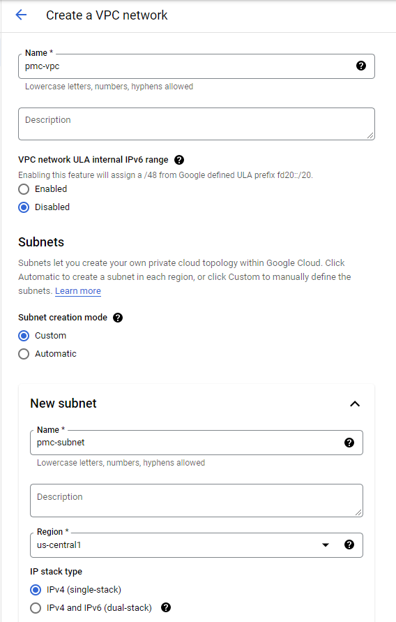  
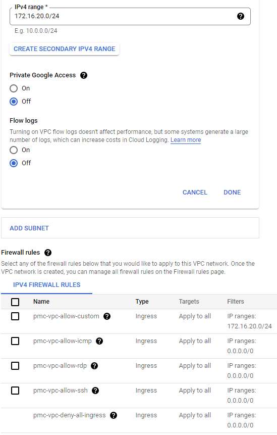

Result:  
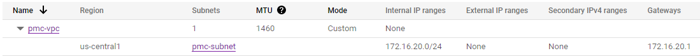

Via gcloud:

```commandline
gcloud compute networks create pmc-vpc --project=epam-gcp-study --subnet-mode=custom --mtu=1460 --bgp-routing-mode=regional

gcloud compute networks subnets create pmc-subnet --project=epam-gcp-study --range=172.16.20.0/24 --stack-type=IPV4_ONLY --network=pmc-vpc --region=us-central1
```

### 2. Create NAT:

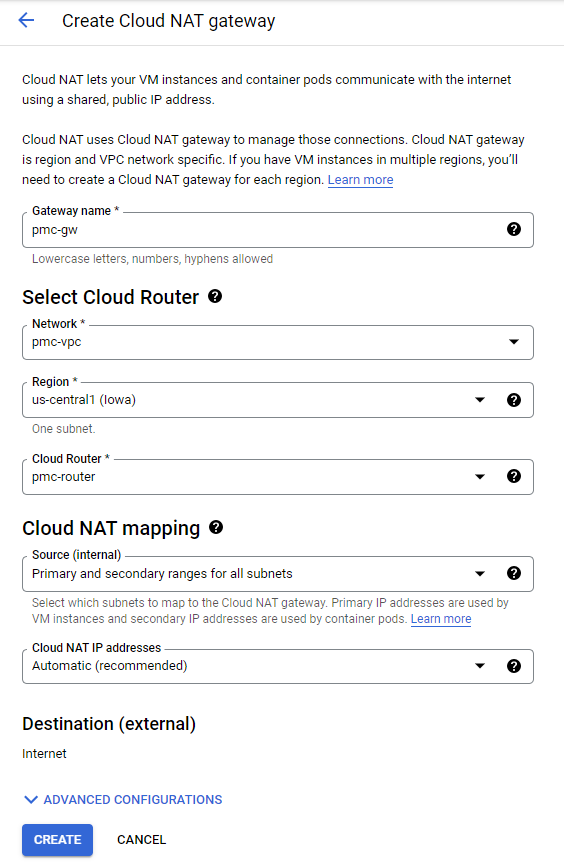
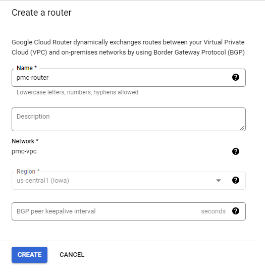

Or via gcloud:  
```commandline
gcloud compute routers nats create pmc-gw \
    --router=pmc-router \
    --auto-allocate-nat-external-ips \
    --nat-all-subnet-ip-ranges \
    --enable-logging
```

### 3. Create Service Account for GCE with appropriate IAM roles:

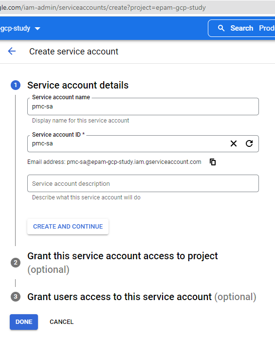
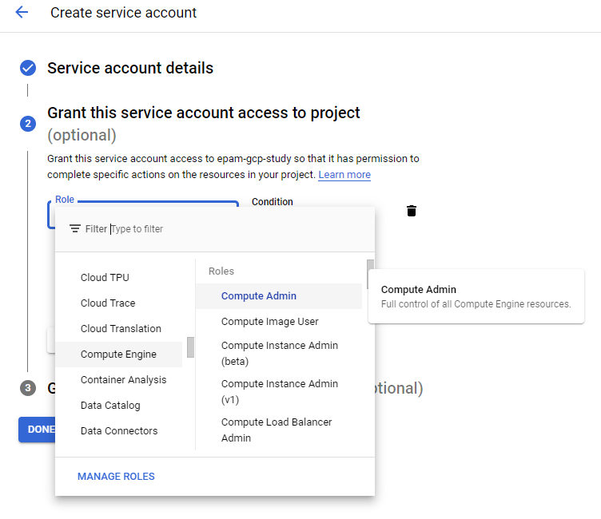
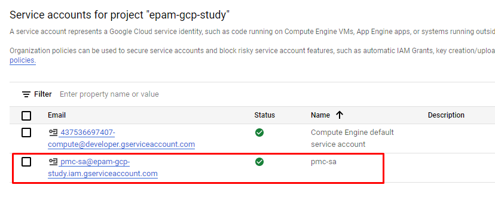

### 4. Create Cloud SQL with Private IP:

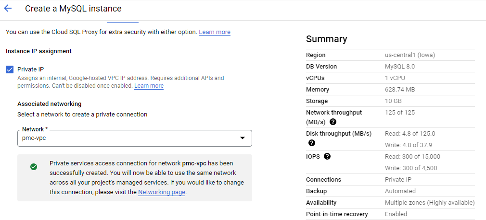

### 5. Create MySQL database and user:
Database creation:  
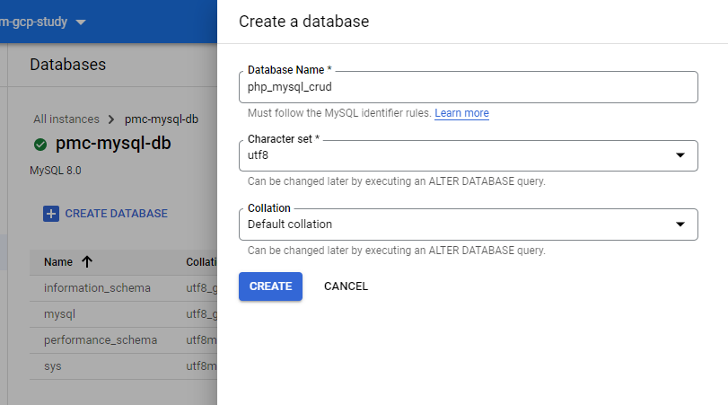

User creation:  
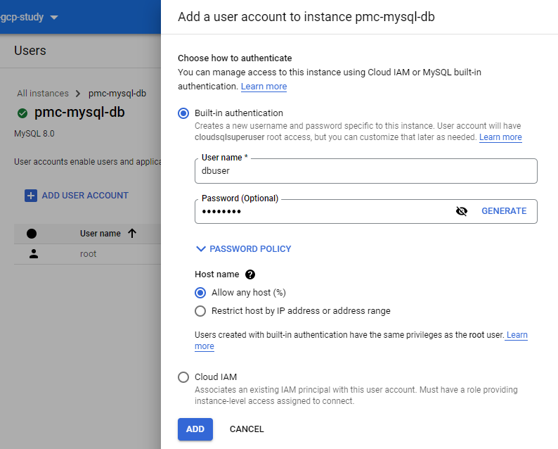

Table creation:  
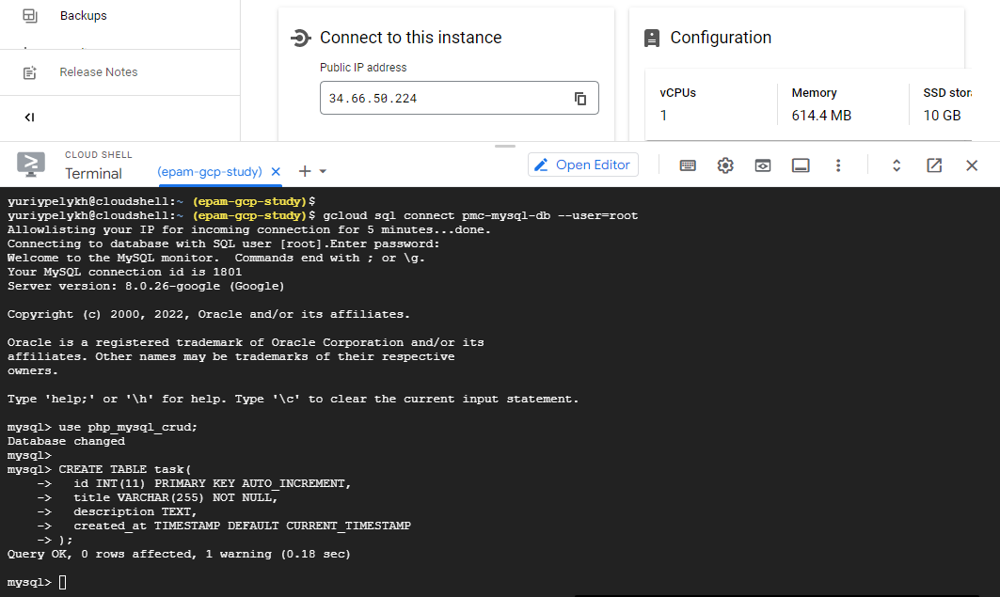

Public IP disable:  
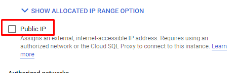

### 6. Create Google Cloud Storage Bucket and upload PHP application:
#### Creating a bucket:  
```commandline
gcloud alpha storage buckets create gs://php-mysql-crud-bucket --project=epam-gcp-study
```
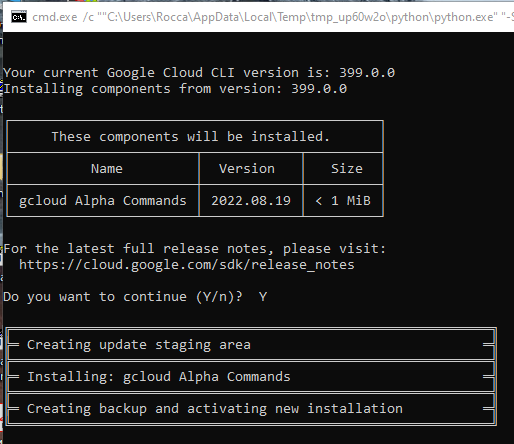
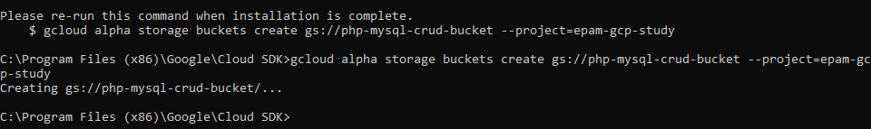
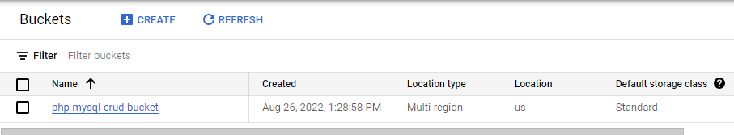

#### Modification of db.php file:  
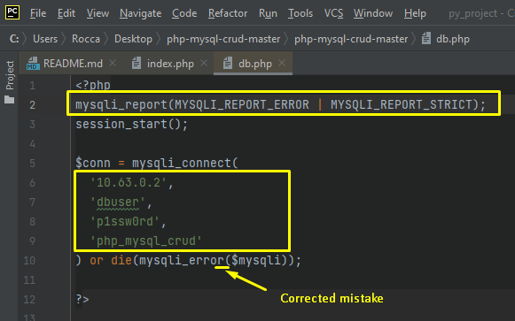
>Note:
>String:  
> ```commandline
> mysqli_report(MYSQLI_REPORT_ERROR | MYSQLI_REPORT_STRICT);
>```
> ... may be added for debug purposes. It allows return clear php error reasons:  
> 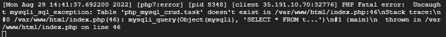
> ... instead of:  
> 

#### Upload files to bucket:  
```commandline
gcloud alpha storage cp -r C:/Users/Rocca/Desktop/php-mysql-crud-master/php-mysql-crud-master/* gs://php-mysql-crud-bucket
```
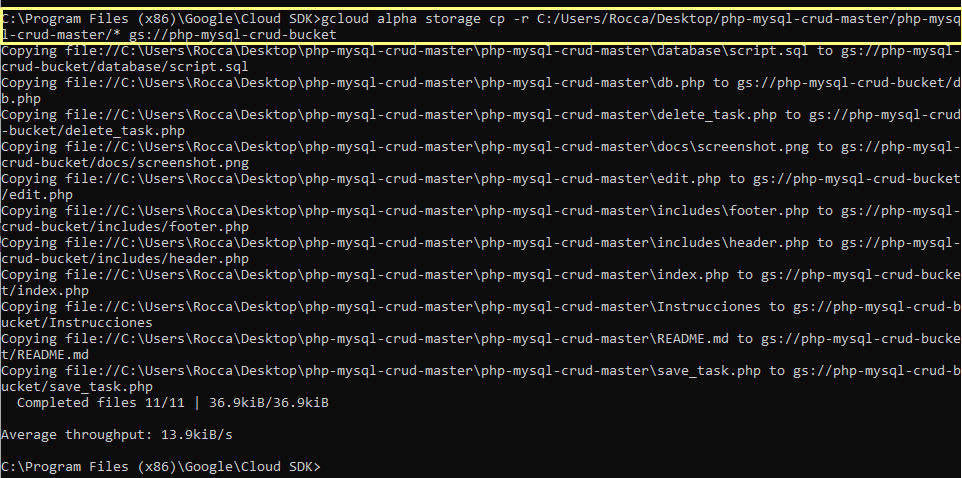
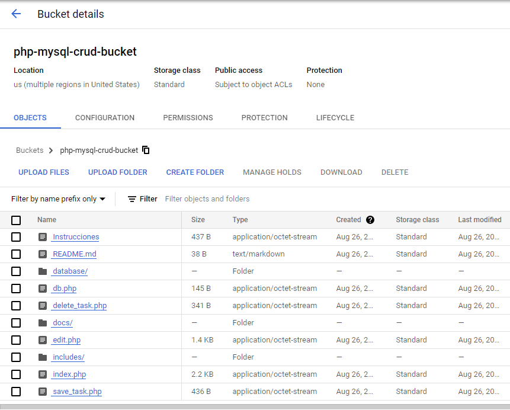

### 7. Create Managed Instance Group. VMs in the MIG must:
#### Creation of Instance Template with required params:  
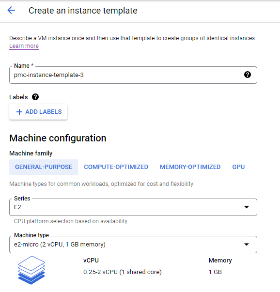
- use SA from step 3:  
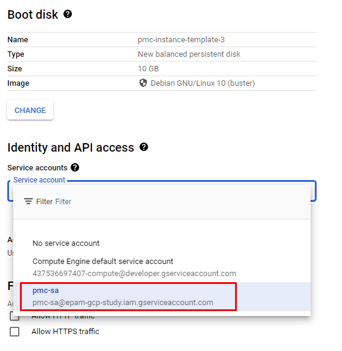

- use only private IP:  
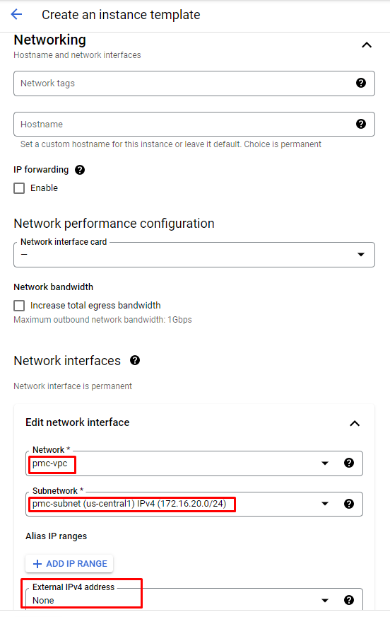

- use startup script for installing web service and downloading PHP application from the bucket (step 6):  
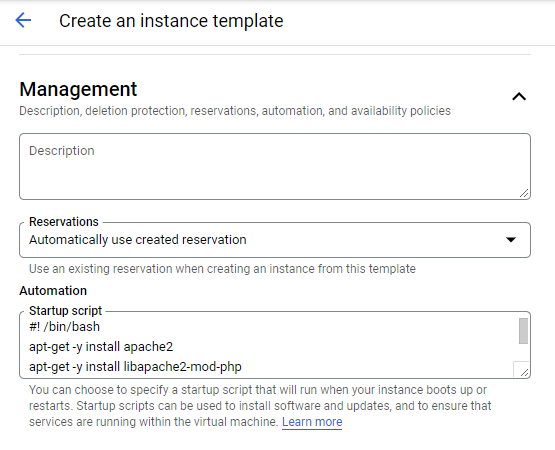

Or instance template creation via **gcloud**:    
```commandline
gcloud compute instance-templates create pmc-instance-template-3 --project=epam-gcp-study --machine-type=e2-micro --network-interface=subnet=pmc-subnet,no-address --metadata=startup-script=\#\!\ /bin/bash$'\n'apt-get\ -y\ install\ apache2$'\n'apt-get\ -y\ install\ libapache2-mod-php$'\n'apt-get\ -y\ install\ php-mysql$'\n'systemctl\ restart\ apache2$'\n'gsutil\ cp\ -r\ gs://php-mysql-crud-bucket/\*\ /var/www/html/ --maintenance-policy=MIGRATE --provisioning-model=STANDARD --service-account=pmc-sa@epam-gcp-study.iam.gserviceaccount.com --scopes=https://www.googleapis.com/auth/cloud-platform --region=us-central1 --create-disk=auto-delete=yes,boot=yes,device-name=pmc-instance-template-3,image=projects/debian-cloud/global/images/debian-10-buster-v20220822,mode=rw,size=10,type=pd-balanced --no-shielded-secure-boot --shielded-vtpm --shielded-integrity-monitoring --reservation-affinity=any
```
#### Creation of Instance Group:
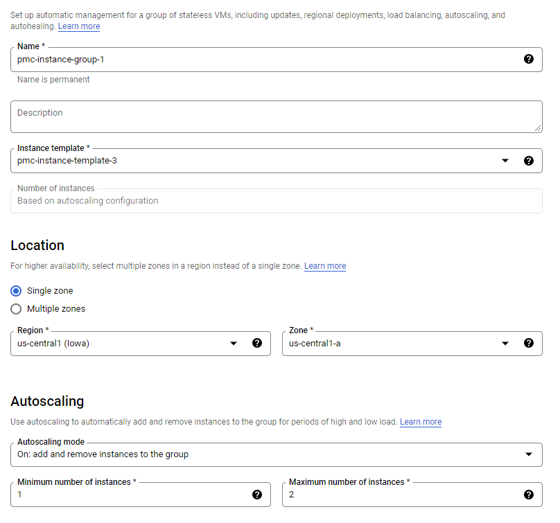
Or via **gcloud**:  
```commandline
gcloud beta compute instance-groups managed create pmc-instance-group-1 --project=epam-gcp-study --base-instance-name=pmc-instance-group-1 --size=1 --template=pmc-instance-template-3 --zone=us-central1-a --list-managed-instances-results=PAGELESS
gcloud beta compute instance-groups managed set-autoscaling pmc-instance-group-1 --project=epam-gcp-study --zone=us-central1-a --cool-down-period=60 --max-num-replicas=2 --min-num-replicas=1 --mode=on --target-cpu-utilization=0.95
```
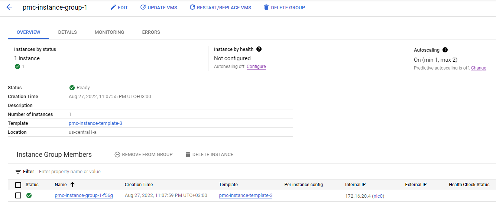

### 8. Create a global external HTTP load balancer with the MIG backend:
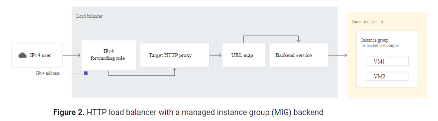

#### Adding of a named port to the instance group:  
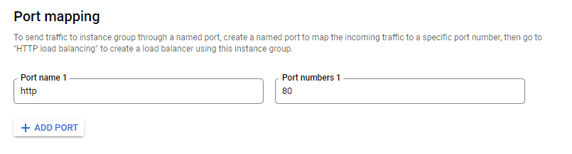

Or:
```commandline
gcloud compute instance-groups set-named-ports pmc-instance-group-1  --named-ports http:80
```

#### Configure a firewall rule:
This is an ingress rule that allows traffic from the Google Cloud health checking systems:  
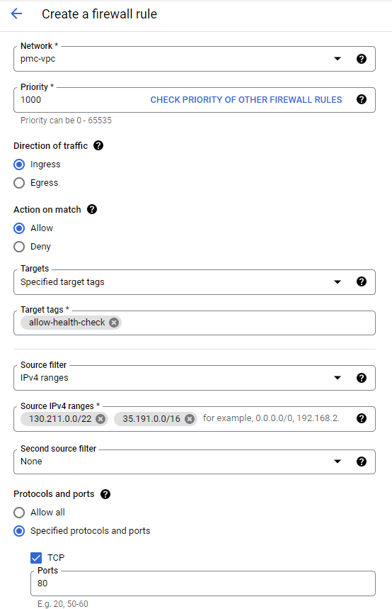

Or:  
```commandline
gcloud compute --project=epam-gcp-study firewall-rules create fw-allow-health-check --direction=INGRESS --priority=1000 --network=pmc-vpc --action=ALLOW --rules=tcp:80 --source-ranges=130.211.0.0/22,35.191.0.0/16 --target-tags=allow-health-check
```

#### Setting up the load balancer:
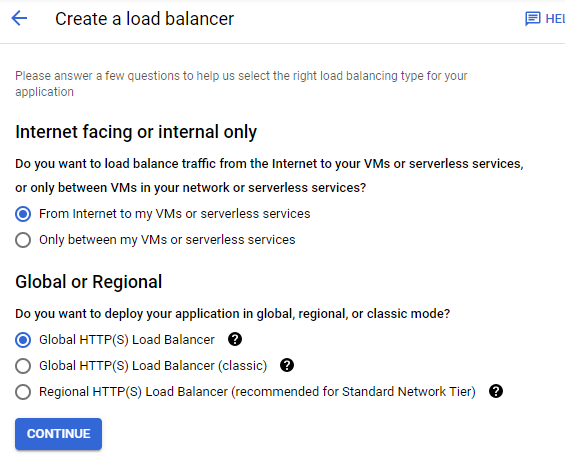
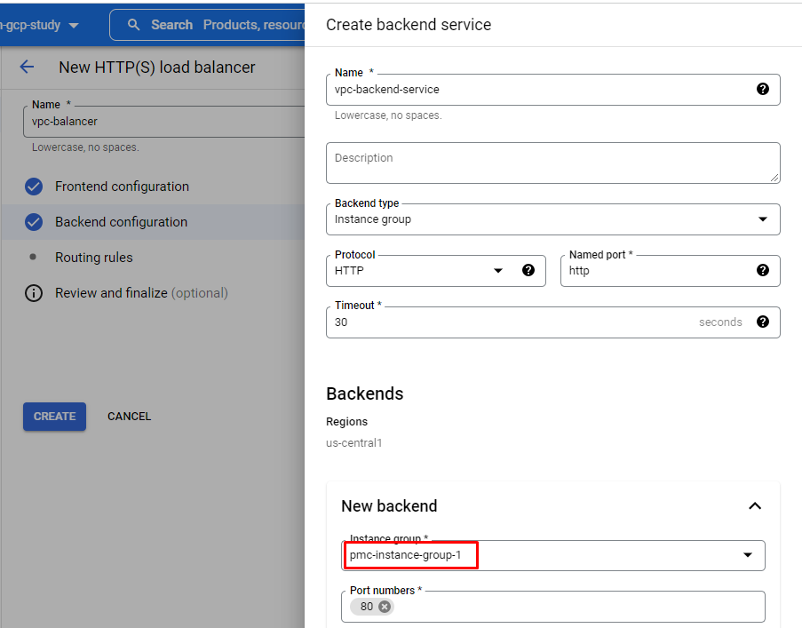
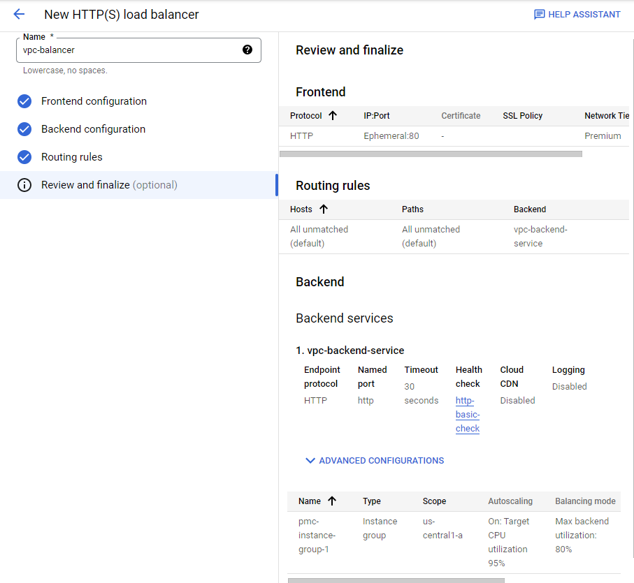

Via CLI:  
```commandline
Create a health check:  

    gcloud compute health-checks create http http-basic-check \
        --port 80
    
Create a backend service.

    gcloud compute backend-services create vpc-backend-service \
        --load-balancing-scheme=EXTERNAL_MANAGED \
        --protocol=HTTP \
        --port-name=http \
        --health-checks=http-basic-check \
        --global
    
Add your instance group as the backend to the backend service.

    gcloud compute backend-services add-backend vpc-backend-service \
        --instance-group=pmc-instance-group-1 \
        --instance-group-zone=us-central1-a \
        --global
    
For HTTP, create a URL map to route the incoming requests to the default backend service.

    gcloud compute url-maps create web-map-http \
        --default-service vpc-backend-service

For HTTP, create a target HTTP proxy to route requests to your URL map.

    gcloud compute target-http-proxies create http-lb-proxy \
        --url-map=web-map-http
    
For HTTP, create a global forwarding rule to route incoming requests to the proxy.

    gcloud compute forwarding-rules create http-content-rule \
        --load-balancing-scheme=EXTERNAL_MANAGED \
        --address=ephemeral \
        --global \
        --target-http-proxy=http-lb-proxy \
        --ports=80
```

### Result:

Created HTTP load balancer:  
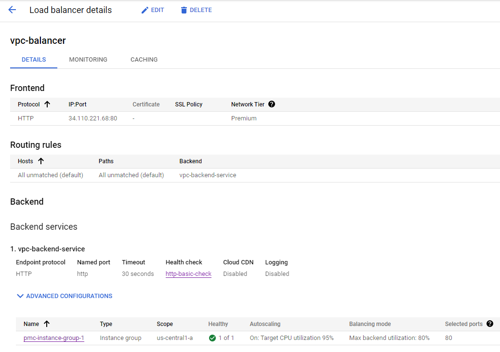

Web service is accessible via balancer's "frontend IP":   
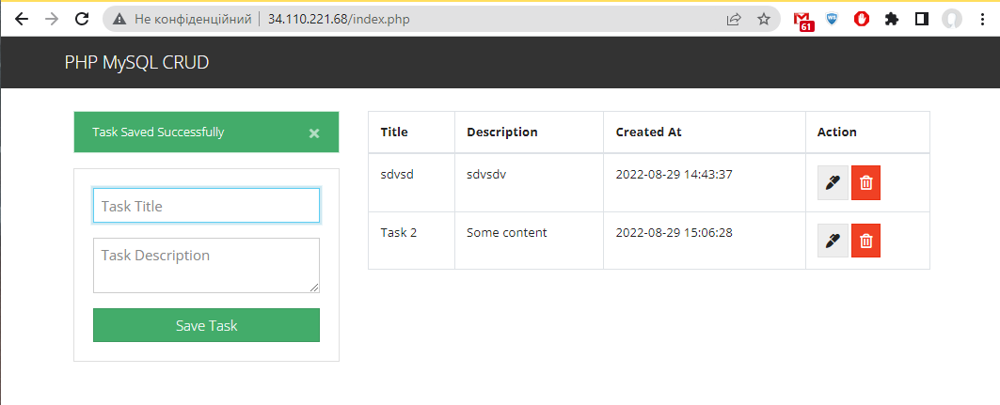


## Sources:  
- [ ] [Setting up a global external HTTP(S) load balancer with a Compute Engine backend](https://cloud.google.com/load-balancing/docs/https/setup-global-ext-https-compute#gcloud_5)
- [ ] [Connection via Cloud Identity-Aware Proxy Failed](https://stackoverflow.com/questions/63147497/connection-via-cloud-identity-aware-proxy-failed)
- [ ] [Connect to Cloud SQL for MySQL from Cloud Shell](https://cloud.google.com/sql/docs/mysql/connect-instance-cloud-shell#gcloud)
- [ ] [Create storage buckets](https://cloud.google.com/storage/docs/creating-buckets#storage-create-bucket-cli)

