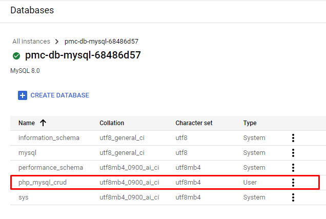

# Task 1: GCP with Terraform

## Task details:  

Загорнути попереднє завдання до тераформ.  
 
I) Створити модулі (найменування можуть бути іншими, але суть зберегти):  
- network: VPC + NAT  
- iam (Service Account, roles, etc.)  
- db (SQL instance, database, user, etc.)  
- storage (Storage Bucket)  
- app-runtime-env (MIG, Template, LB etc.)  
II) Використовувати variables по максимуму.  
III) Продумати output таким чином, щоб було зручно використовувати для інших DevOps tools.  
      Наприклад, якщо ми використовуємо Ansible для деплою, нам необхідно знати SQL instance name, user, db etc.  
      Для користувачів потрібно знати IP Load Balancera.  
IV ) State зберігати у бакеті  
 
Буде плюсом:  
+ використання terraform cloud  
 
# Task report:  

## Terraform-files:
- [ ] Main configs: [main.tf](./main.tf), [vars.tf](./vars.tf), [terraform.tfvars](./terraform.tfvars), [outputs.tf](./outputs.tf)  
- [ ] Module **network** (VPC, NAT): [network/](./network/)
- [ ] Module **iam** (Service Account, Roles): [iam/](./iam/)
- [ ] Modile **db** (SQL Instance, Database, User): [db/](./db/)  
- [ ] Module **storage** (Storage Bucket): [storage/](./storage/)
- [ ] Module **app-runtime-env** (Managed Instance Group, Instance Template, Load Balancer): [app-runtime-env/](./app-runtime-env/)

## Working environment:

Service account with key was created for Terraform be able connect to GCP:     
  
  

## I) Modules creation

### Network module:
Such entities as **network**, **subnetwork**, **cloud-router** and **cloud-nat** where provisioned:     

Code:  
```commandline
resource "google_compute_network" "network" {
  name                            = var.network_name
  auto_create_subnetworks         = var.auto_create_subnetworks
  routing_mode                    = var.routing_mode
  project                         = var.project_id
  description                     = var.description
  delete_default_routes_on_create = var.delete_default_internet_gateway_routes
  mtu                             = var.mtu
}

resource "google_compute_subnetwork" "subnetwork" {
  name          = var.subnet_name
  ip_cidr_range = var.subnet_ip_range
  region        = var.subnet_region
  network       = google_compute_network.network.id
}

resource "google_compute_router" "router" {
  name    = var.cloud_router_name
  region  = google_compute_subnetwork.subnetwork.region
  network = google_compute_network.network.id

  bgp {
    asn = 64514
  }
}

resource "google_compute_router_nat" "nat" {
  name                               = var.cloud_nat_name
  router                             = google_compute_router.router.name
  region                             = google_compute_router.router.region
  nat_ip_allocate_option             = "AUTO_ONLY"
  source_subnetwork_ip_ranges_to_nat = "ALL_SUBNETWORKS_ALL_IP_RANGES"

  log_config {
    enable = true
    filter = "ERRORS_ONLY"
  }
}
```
Result of _**terraform apply**_ execution:  


### IAM module:

Service account and appropriate roles where created with following config:  
```commandline
resource "google_service_account" "service-account" {
  account_id    = var.service_account_id
  display_name  = var.service_account_name
}

locals {
  roles = {
    for x in var.iam_roles :
    x => x
  }
}

resource "google_project_iam_member" "iam-role" {
  for_each  = local.roles
  project   = var.project_id
  role      = each.value
  member    = "serviceAccount:${google_service_account.service-account.email}"
}

```

Result of execution _**terraform apply**_ command:  


### DB module:

Entities been created by module: **private-ip-address**, **private-vpc-connection**, **sql-database-instance**, **sql-database**. 

```commandline
resource "google_compute_global_address" "private-ip-address" {
  name          = "private-ip-address"
  purpose       = "VPC_PEERING"
  address_type  = "INTERNAL"
  network       = var.db_network
  address       = "10.64.0.0"
  prefix_length = 24
}

resource "google_service_networking_connection" "private-vpc-connection" {
  network                 = var.db_network
  service                 = "servicenetworking.googleapis.com"
  reserved_peering_ranges = [google_compute_global_address.private-ip-address.name]
}

resource "random_id" "db_instance_name_suffix" {
  byte_length = 4
}

resource "google_sql_database_instance" "sql-database-instance" {
  name                 = "${var.db_instance_name}-${random_id.db_instance_name_suffix.hex}"
  region               = var.db_region
  database_version     = var.db_instance_version
  deletion_protection  = false
  depends_on           = [google_service_networking_connection.private-vpc-connection]

  settings {
    tier              = var.db_instance_type
    disk_size         = 10
    availability_type = "ZONAL"
    ip_configuration {
      ipv4_enabled    = false
      private_network = var.db_network
    }
  }

//  provisioner "remote-exec" {
//    inline = [
//      "mysql -u root -p${random_password.root-password.result} -e \"${file(var.db_schema_script)}\"",
//    ]
//  }
}

resource "google_sql_database" "sql-database" {
  name       = var.db_name
  instance   = google_sql_database_instance.sql-database-instance.name
}

resource "google_sql_user" "sql-user" {
  name       = var.db_user_name
  instance   = google_sql_database_instance.sql-database-instance.name
  host       = var.db_user_connect_host
  password   = var.db_user_password
}
```

Result of execution _**terraform apply**_ command:  


Result in Google Console:  




### Storage module:

Two Storage Buckets were created: one for Terraform state file, another - for application files been uploaded. Module's main.tf code:  
```commandline
resource "google_storage_bucket" "tfstate-bucket" {
  name = var.tf_bucket_name
  force_destroy = false
  location      = var.tf_bucket_location
  storage_class = var.tf_bucket_class
  versioning {
    enabled = true
  }

  lifecycle {
    prevent_destroy = true
  }
}

resource "google_storage_bucket" "app-bucket" {
  name = var.app_bucket_name
  force_destroy = false
  location      = var.app_bucket_location
  storage_class = var.app_bucket_class
  versioning {
    enabled = true
  }

  lifecycle {
    prevent_destroy = true
  }
}
```

Result of execution _**terraform apply**_ command:  


Two buckets have been created and may be observed via console:  


We already have internal IP of MySQL database, created on previous step, so can specify IP in **db.php** file an upload all application files to Storage Bucket just have been created:  


### Application runtime environment module:

Entities been created: **instance-template**, **instance-group**, **firewall**, **health-check**, **backend-service**, **url-map**, **target_http_proxy**, **global_forwarding_rule**. Code:  
```commandline
resource "google_compute_instance_template" "instance-template" {
  name = var.instance_template_name
  description = "This template is used to create app server instances."

  tags = ["allow-health-check"]

  labels = {
    environment = "dev"
  }

  instance_description = "description assigned to instances"
  machine_type = var.instance_type
  can_ip_forward = false

  scheduling {
    automatic_restart = true
    on_host_maintenance = "MIGRATE"
  }

  // Create a new boot disk from an image
  disk {
    source_image = "debian-cloud/debian-10"
    auto_delete = true
    boot = true
    disk_size_gb = 10
    disk_type = "pd-balanced"
    // Backup the disk every day:
    // resource_policies = [google_compute_resource_policy.daily_backup.id]
  }

  network_interface {
    network = var.instance_network
    subnetwork = var.instance_subnet

    //access_config {             //Making even empty access_config will create ephemeral External IP by default
    //  nat_ip = null             //To disable External IP access_config should be absent.
    //  network_tier = "PREMIUM"
    //}
  }

  service_account {
    # Google recommends custom service accounts that have cloud-platform scope and permissions granted via IAM Roles.
    email = var.instance_service_account
    scopes = ["cloud-platform"]
  }

  metadata = {
    startup-script = "#! /bin/bash\napt-get -y install apache2\napt-get -y install libapache2-mod-php\napt-get -y install php-mysql\nrm -f /var/www/html/index.html\ngsutil cp -r gs://${var.app_bucket_name}/* /var/www/html/\nsed -i -r 's/([0-9]{1,3}\\.){3}[0-9]{1,3}/${var.db_instance_ip}/g' /var/www/html/db.php\nsystemctl restart apache2"
  }
}

//resource "google_compute_resource_policy" "daily_backup" {
//  name   = "every-day-4am"
//  region = "us-central1"
//  snapshot_schedule_policy {
//    schedule {
//      daily_schedule {
//        days_in_cycle = 1
//        start_time    = "04:00"
//      }
//    }
//  }
//}

resource "google_compute_instance_group_manager" "instance-group" {
  name = var.instance_group_name
  base_instance_name = "vm"
  zone = var.instance_group_zone
  target_size = 1

  version {
    instance_template  = google_compute_instance_template.instance-template.id
  }

  named_port {
    name = "http"
    port = 80
  }
}

resource "google_compute_firewall" "firewall" {
  name          = "fw-allow-health-check"
  direction     = "INGRESS"
  //network       = "global/networks/${var.instance_network}"
  network       = var.instance_network
  priority      = 1000
  source_ranges = ["130.211.0.0/22", "35.191.0.0/16"]
  target_tags   = ["allow-health-check"]

  allow {
    ports    = ["80"]
    protocol = "tcp"
  }
}

resource "google_compute_health_check" "health_check" {
  name               = "http-basic-check"
  check_interval_sec = 5
  healthy_threshold  = 2
  http_health_check {
    port               = 80
    port_specification = "USE_FIXED_PORT"
    proxy_header       = "NONE"
    request_path       = "/"
  }
  timeout_sec         = 5
  unhealthy_threshold = 2
}

resource "google_compute_backend_service" "backend-service" {
  name                            = "web-backend-service"
  connection_draining_timeout_sec = 0
  health_checks                   = [google_compute_health_check.health_check.id]
  load_balancing_scheme           = "EXTERNAL_MANAGED"
  port_name                       = "http"
  protocol                        = "HTTP"
  session_affinity                = "NONE"
  timeout_sec                     = 30
  backend {
    group           = google_compute_instance_group_manager.instance-group.instance_group
    balancing_mode  = "UTILIZATION"
    capacity_scaler = 1.0
  }
}

resource "google_compute_url_map" "url-map" {
  name            = "http-balancer"
  default_service = google_compute_backend_service.backend-service.id
}

resource "google_compute_target_http_proxy" "http-proxy" {
  name    = "http-lb-proxy"
  url_map = google_compute_url_map.url-map.id
}

resource "google_compute_global_forwarding_rule" "forwarding-rule" {
  name                  = "http-content-rule"
  ip_protocol           = "TCP"
  load_balancing_scheme = "EXTERNAL_MANAGED"
  port_range            = "80-80"
  target                = google_compute_target_http_proxy.http-proxy.id
  //ip_address            = google_compute_global_address.default.id      //Disabled for ephemeral IP. Static was not reserved.
}
```

Result of execution _**terraform apply**_ command:  


Execution result control via Console:  


Web-app work checkout:  


Final check - **terraform destroy** all and then **terraform apply** all infrastructure services together:  


From output: external IP of HTTP Balancer is 34.110.208.116:  


## IV ) State зберігати у бакеті:

Terraform backend config added:  
```commandline
terraform {
  backend "gcs" {
    bucket = "pmc-tfstate-bucket"
    prefix = "terraform/state"
    credentials = "C:/Users/Rocca/Desktop/epam-gcp-tf-3a080f9b9983.json"
  }
...
}
```

Now **init** needed and acception to copy state-files in bucket:  


## V ) Використання Terraform Cloud:

Get back state to local by commenting gcs:  


Added Terraform Cloud config:  

```commandline
cloud {
    organization = "Yurii_Pelykh"

    workspaces {
      name = "pmc-workspace"
    }
  }
```

Execution of **_terraform login_**:  


Execution of **_terraform init_**:  


## Sources:  

- [ ] [Cloud Playground](https://learn.acloud.guru/cloud-playground/cloud-sandboxes)
- [ ] [Error: Attempted to load application default credentials since neither credentials nor access_token was set in the provider block.](https://github.com/terraform-google-modules/terraform-google-sql-db/issues/145)
- [ ] [Build Infrastructure - Terraform GCP Example](https://learn.hashicorp.com/tutorials/terraform/google-cloud-platform-build?in=terraform/gcp-get-started)
- [ ] [Terraform: google_compute_network](https://registry.terraform.io/providers/hashicorp/google/latest/docs/resources/compute_network)
- [ ] [Entity: google_service_account](https://registry.terraform.io/providers/hashicorp/google/latest/docs/resources/google_service_account)
- [ ] [Entity: google_compute_instance_template](https://registry.terraform.io/providers/hashicorp/google/latest/docs/resources/compute_instance_template)
- [ ] [Store Terraform state in a Cloud Storage bucket](https://cloud.google.com/docs/terraform/resource-management/store-state)
- [ ] [How to properly create gcp service-account with roles in terraform](https://stackoverflow.com/questions/61003081/how-to-properly-create-gcp-service-account-with-roles-in-terraform)
- [ ] [terraform-google-modules](https://github.com/terraform-google-modules/terraform-google-network)
- [ ] [Entity: google_compute_router_nat](https://registry.terraform.io/providers/hashicorp/google/latest/docs/resources/compute_router_nat)
- [ ] [Entety: google_compute_subnetwork](https://registry.terraform.io/providers/hashicorp/google/latest/docs/resources/compute_subnetwork)
- [ ] [IAP: Connection via Cloud Identity-Aware Proxy Failed](https://stackoverflow.com/questions/63147497/connection-via-cloud-identity-aware-proxy-failed)
- [ ] [Entity: google_compute_instance_template](https://registry.terraform.io/providers/hashicorp/google/latest/docs/resources/compute_instance_template#access_config)
- [ ] [Entity: google_compute_instance_group_manager](https://registry.terraform.io/providers/hashicorp/google/latest/docs/resources/compute_instance_group_manager)
- [ ] [Terraform - Delete all resources except one](https://stackoverflow.com/questions/55265203/terraform-delete-all-resources-except-one)
- [ ] [Terraform depends_on with modules](https://stackoverflow.com/questions/58275233/terraform-depends-on-with-modules)
- [ ] [Entity: google_sql_database_instance](https://registry.terraform.io/providers/hashicorp/google/latest/docs/resources/sql_database_instance)
- [ ] [Entity: google_compute_global_address](https://registry.terraform.io/providers/hashicorp/google/latest/docs/resources/compute_global_address)
