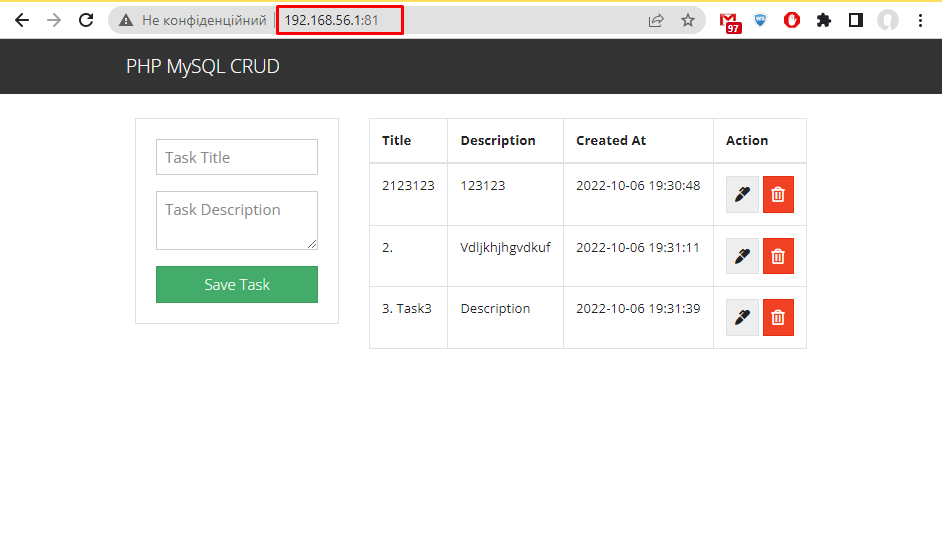

# Task 1: Configuration Management with Ansible

## Task details:  

Создать свой inventory file, в котором группы хостов: app, db
Для всех групп - доступ по ssh ключу. Конфигурация общих ssh параметров и месторасположение Inventory - вынести в ansible.cfg
Создать playbook, который выполняет следующее:
1. Устанавливает apache и php на app хосты
2. Ставит mysql на db хост
3. создаёт пользователя и базу, которую нужно потом использовать в https://github.com/FaztWeb/php-mysql-crud/blob/master/db.php
4. Деплоит код проекта https://github.com/FaztWeb/php-mysql-crud
Для конфигурации apache и mysql подключения php кода использовать jinja-шаблоны. Избегайте использования модулей shell, command и им подобных. 

# Task report:  

## Files:
- [ ] Vagrant files for VMs creation: [vagrant/](./vagrant/)
- [ ] Ansible general config files: [ansible.cfg](./ansible/ansible.cfg), [hosts](./ansible/hosts), [playbook.yml](./ansible/playbook.yml);  
- [ ] Ansible "DB-Servers Configuration Role" files: [dbservers-config/](./ansible/dbservers-config/)
- [ ] Ansible "Web-Servers Configuration Role" files: [webservers-config/](./ansible/webservers-config/)

## I) DB-Servers Configuration Role work demo:

Role directories structure:  

Playbook execution result:  

## I) DB-Servers Configuration Role work demo:

Role directories structure:  

Playbook execution result:  

While tried to open app web-page, Error 500 occurred. Apache service must be restarted after changes in the _html_ directory, so add one more task into **app-deploy.yml**:  

Playbook execution result:  

Web-page now is accessible:  

Let's add one more App server and configure it with Ansible:  

To check WEB-SRV2 returns page correctly, port forwarding config should be performed. IP is the same, but second Web-server should answer on differ port:  

## Sources:  

- [ ] [Настройка LEMP-сервера с помощью Ansible](https://habr.com/ru/company/nixys/blog/668458/)
- [ ] [Про Ansible для новичков: Практика (часть I)](https://habr.com/ru/company/nixys/blog/672656/)
- [ ] [Про Ansible для новичков: Практика (часть II)](https://habr.com/ru/company/nixys/blog/674088/)
- [ ] [Ansible - MYSQL installation](https://medium.com/@kelom.x/ansible-mysql-installation-2513d0f70faf)
- [ ] [Create MySQL Tables with Ansible](https://stackoverflow.com/questions/29179856/create-mysql-tables-with-ansible)
- [ ] [СОЗДАНИЕ ШАБЛОНОВ В ПЛЕЙБУКАХ ANSIBLE](https://www.8host.com/blog/sozdanie-shablonov-v-plejbukax-ansible/)
- [ ] [Ansible Playbook to Install and Setup Apache on Ubuntu](https://linuxopsys.com/topics/ansible-playbook-to-install-apache)
- [ ] [ansible.builtin.git module – Deploy software (or files) from git checkouts](https://docs.ansible.com/ansible/latest/collections/ansible/builtin/git_module.html)
