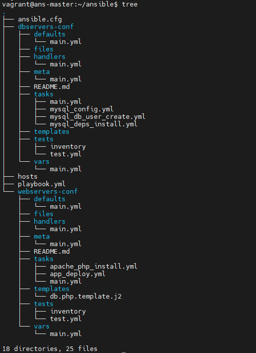

#### Ansible general config files:
- [ ] [ansible.cfg](./ansible/ansible.cfg);
- [ ] [hosts](./ansible/hosts);
- [ ] [playbook.yml](./ansible/playbook.yml);  

#### Ansible DB-Servers Configuration Role:
- [ ] [dbservers-config/](./ansible/dbservers-config/)

#### Ansible Web-Servers Configuration Role:
- [ ] [webservers-config/](./ansible/webservers-config/)

#### Directories tree:
